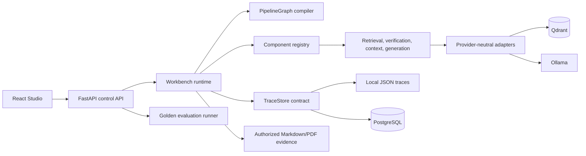
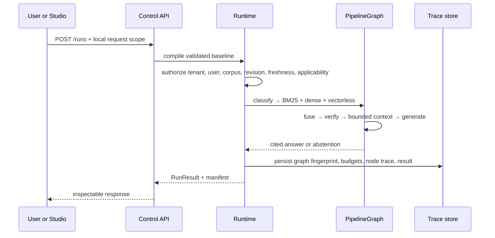

# System Architecture

## Dependency rule

Dependencies point inward: Studio and API call control/runtime services; those services depend on contracts,
the graph compiler, and registry; components depend on provider-neutral interfaces; provider adapters do not
define domain contracts or graph behavior.

The component registry is the only execution boundary. A component declares inputs and outputs in a manifest;
the graph binds it explicitly. Components cannot invoke arbitrary downstream components.

## Evidence-first execution

Authorization happens before retrieval. The generator receives only approved, permitted evidence that fits the
context budget. If verification finds insufficient evidence, generation returns an explicit abstention.

## Local deployment boundary

The deterministic profile is the reproducible default: it needs no model download and is the fixture/CI
baseline. The optional local provider profile selects Qdrant for dense search and Ollama for generation through
platform configuration, not pipeline YAML. The selected model is recorded in each run manifest. Adapter failure
fails the trace; it never changes provider silently.

| Layer | Owns | Does not own |
| --- | --- | --- |
| Platform configuration | local services, provider profile, trace storage, local CORS | customer policy or pipeline semantics |
| Customer configuration | corpus permissions, policy, data, evaluation sets | shared-code forks |
| Pipeline configuration | versioned nodes, edges, component config, budgets | provider credentials or tenant secrets |

See [ADRs](../adr/) for decisions and [Configuration](../reference/configuration.md) for local settings.
