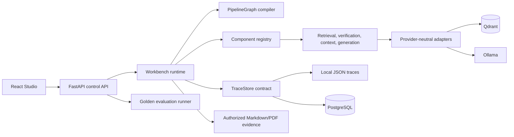
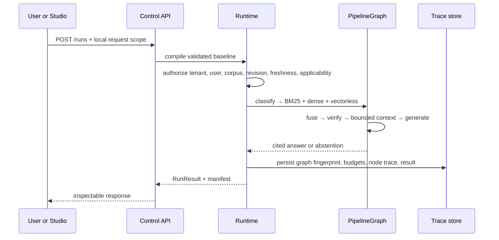
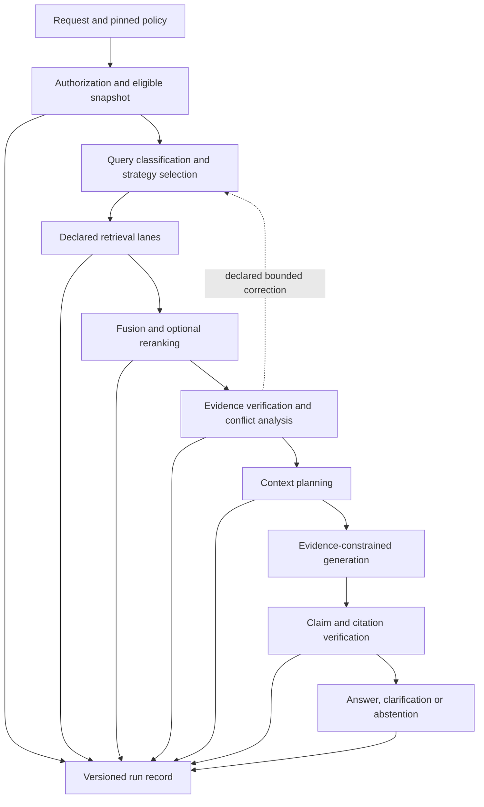

# Documentation Compendium

This file combines the Markdown documentation under `docs/` for convenient reading. Each section names its source file. Individual files remain the editable source of truth; links in copied sections are relative to the named source file.

## Contents

1. `README.md`
2. `adr/001-platform-owned-graph.md`
3. `adr/002-local-python-typescript-stack.md`
4. `adr/003-local-providers.md`
5. `adr/004-retrieval-baseline.md`
6. `adr/005-local-observability.md`
7. `adr/006-local-admin-security.md`
8. `adr/007-contract-driven-execution.md`
9. `adr/008-durable-local-traces.md`
10. `adr/009-local-provider-profiles.md`
11. `adr/010-v2-incremental-evidence-platform.md`
12. `adr/template.md`
13. `api/README.md`
14. `architecture/README.md`
15. `architecture/system.md`
16. `data-engineer-guide/README.md`
17. `definition-of-done/README.md`
18. `design-principles/README.md`
19. `developer-guide/README.md`
20. `evaluation/README.md`
21. `observability/README.md`
22. `operations/README.md`
23. `product/roadmap-and-specification.md`
24. `product-ux/README.md`
25. `product-ux/ai-native-workspace-guide.md`
26. `reference/configuration.md`
27. `research/README.md`
28. `security/README.md`
29. `testing/README.md`
30. `user-guide/first-local-run.md`
31. `v2/current-system-assessment.md`
32. `v2/evaluation-plan.md`
33. `v2/implementation-status.md`
34. `v2/migration-plan.md`
35. `v2/requirements.md`
36. `v2/research-plan.md`
37. `v2/target-architecture.md`
38. `validation/README.md`


---

<!-- Source: README.md -->

# Documentation

This is the living documentation index for the Local-First Graph-Native RAG Workbench. Product behavior is
defined by typed contracts, versioned pipeline YAML, and executable tests; these guides explain how to use and
operate that behavior without duplicating provider implementation details.

For a single-file reading copy of all Markdown documentation under this directory, see the
[Documentation Compendium](doc.md). The individual files remain the editable source of truth.

## Start here

| Audience | Read this | Outcome |
| --- | --- | --- |
| Product owner | [Goals](../Goals.md), [Design principles](design-principles/README.md), [Definition of Done](definition-of-done/README.md), [Evaluation](evaluation/README.md) | Decide whether a retrieval strategy is ready to accept. |
| Studio user | [First local run](user-guide/first-local-run.md) | Run and inspect the evidence-first baseline. |
| API consumer | [API reference](api/README.md) | Call the local control API with the required request scope. |
| Data engineer | [Data engineer guide](data-engineer-guide/README.md), [Configuration reference](reference/configuration.md) | Prepare evidence and select measured retrieval behavior. |
| Developer | [Developer guide](developer-guide/README.md), [Architecture](architecture/system.md), [ADRs](adr) | Extend components without breaking graph or provider boundaries. |
| Operator | [Operations](operations/README.md), [Configuration reference](reference/configuration.md), [Security](security/README.md) | Start a reproducible local stack and inspect durable traces. |

## V2 requirements

Start with the [V2 requirements and coverage map](v2/requirements.md). It links the assessment, target architecture,
migration/backlog, evaluation and research plans. These specifications describe planned behavior; the assessment
records verified current behavior.

## Reference map

- [Product roadmap and specification](product/roadmap-and-specification.md) defines the concept, planned feature inventory, phase gates, and working practices.
- [Architecture](architecture/system.md) explains dependencies, runtime flow, and local service boundaries.
- [API reference](api/README.md) documents the FastAPI endpoints. The live local OpenAPI schema is served at
  `/openapi.json`, with interactive Swagger UI at `/docs`.
- [Configuration](reference/configuration.md) lists supported local settings and their ownership layer.
- [First local run](user-guide/first-local-run.md) is a safe deterministic walkthrough.
- [Definition of Done](definition-of-done/README.md) is the acceptance gate for every change.

## Writing standard

Write for the decision the reader must make. Lead with the product outcome, state what is available today and
what is intentionally later, use the same terms as the code (`PipelineGraph`, evidence, citation, abstention,
run manifest), and never turn a local default or a placeholder token into a production promise. Update a guide
when its public behavior changes; `scripts/check_docs.py` protects the API, configuration, and local links.

## Maintenance

`scripts/check_docs.py` extracts routes from `rag_workbench/api.py` and checks that the API and configuration
references still cover the public local surface. It runs in CI. Update the relevant guide, this index, and the
check when a new public route or configuration setting is intentionally introduced.


---

<!-- Source: adr/001-platform-owned-graph.md -->

# ADR-001: Platform-Owned PipelineGraph

## Status

Accepted

## Context

The workbench must outlive orchestration-framework choices and make dependencies inspectable.

## Decision

Compile declarative pipeline configuration to a platform-owned typed IR and execute it with a bounded local interpreter.

## Consequences

Framework adapters may be added later; the initial executor is deliberately small and deterministic.


---

<!-- Source: adr/002-local-python-typescript-stack.md -->

# ADR-002: Python Runtime and TypeScript Studio

## Status

Accepted

## Decision

Use Python/FastAPI/Pydantic for RAG contracts/runtime and React/TypeScript for the inspector workbench.

## Consequences

This fits local RAG tooling while keeping the operator UX strongly typed. API contracts are the boundary.


---

<!-- Source: adr/003-local-providers.md -->

# ADR-003: Local Provider Baseline

## Status

Accepted

## Decision

Compose PostgreSQL, MinIO, Qdrant, and Ollama locally; use provider interfaces so they remain replaceable.

## Consequences

Tests use deterministic in-process implementations. A running external provider is never required for unit tests.


---

<!-- Source: adr/004-retrieval-baseline.md -->

# ADR-004: Three-Lane Retrieval Baseline

## Status

Accepted

## Decision

Ship lexical, dense, and vectorless hierarchical lanes before specialized agentic behavior.

## Consequences

Every lane needs its own retrieval trace and regression cases; fusion is explicit in pipeline configuration.


---

<!-- Source: adr/005-local-observability.md -->

# ADR-005: Local Observability Is Mandatory

## Status

Accepted

## Decision

Persist local traces and run manifests first; OTEL/Langfuse are optional exporters.

## Consequences

The workbench remains diagnosable offline. Export failures cannot fail a pipeline run.


---

<!-- Source: adr/006-local-admin-security.md -->

# ADR-006: Local Admin with Future ACL Contracts

## Status

Accepted

## Decision

Use one local administrator initially, while all evidence/run contracts retain tenant, user, policy, and ACL fields.

## Consequences

Full RBAC is deferred without weakening the domain boundary or safety defaults.


---

<!-- Source: adr/007-contract-driven-execution.md -->

# ADR-007: Execute Pipeline Bindings Through the Registry

## Status

Accepted

## Context

Hard-coded component dispatch made the graph descriptive rather than authoritative and allowed components to bypass budgets.

## Decision

Compile node bindings against manifest port types, then resolve inputs and invoke registry-provided executors at runtime. Account for context and output tokens at this boundary; persist a terminal trace in all outcomes.

## Consequences

New components require a manifest, executor, typed ports, tests, and telemetry. This removes hidden runtime coupling and makes invalid bindings fail before execution.


---

<!-- Source: adr/008-durable-local-traces.md -->

# ADR-008: Durable Trace Storage With Local and PostgreSQL Adapters

## Status

Accepted

## Context

Run manifests must survive API restarts and remain inspectable by the Studio without binding the runtime to one storage vendor.

## Decision

Use the `TraceStore` contract. Unit tests retain an in-memory store, local development without a database uses atomic JSON manifests, and Docker Compose uses PostgreSQL JSONB manifests.

## Consequences

Runtime contracts stay provider-neutral while local runs become durable. Object-backed evidence packages remain a separate future adapter.


---

<!-- Source: adr/009-local-provider-profiles.md -->

# ADR-009: Explicit Local Provider Profiles

## Status

Accepted

## Context

The platform ships deterministic local components for reproducible fixtures and local Qdrant/Ollama adapters
for measured provider runs. Selecting an adapter inside pipeline YAML would couple a public graph definition to
provider implementation details. Falling back from an unavailable provider would make a run misleading.

## Decision

Select deterministic or local Qdrant/Ollama adapters through platform environment configuration at runtime
composition. Keep the graph component references provider-neutral. The selected generation model is recorded
in the immutable run manifest. A selected adapter that fails causes a failed, inspectable run manifest.

## Consequences

The default remains deterministic and does not need Docker model provisioning. Provider-enabled Compose smoke
tests are opt-in and must prove the selected services are available before being called accepted.


---

<!-- Source: adr/010-v2-incremental-evidence-platform.md -->

# ADR-010: Incremental V2 evolution and measured promotion

## Status

Accepted for specification and implementation sequencing; runtime capabilities remain subject to their acceptance gates.

## Context

The current graph/registry/local-provider foundations support incremental evolution, while retrieval, verification and evaluation implementations are intentionally small. Replacing the platform would discard useful contracts and fixtures without resolving their measured gaps. The V2 brief requires a strong local baseline before adaptive retrieval.

## Decision

Retain the platform-owned graph IR, registry boundary, provider-neutral contracts and deterministic profile. Specify a separate local-real profile, versioned strategy/dataset/experiment records, explicit claim verification and an A–F baseline comparison. Require authorization inside indexed candidate selection and on every corrective action. Introduce advanced-research only after the baseline is reproducible. Target Apple Silicon M3 with Docker Desktop and optional native local model serving.

## Consequences

Existing artifacts remain readable; changed behavior gets new versions and index migration. Reranking, classification and claim verification enter the first V2 milestone. Model and provider choices remain pending measured feasibility and licensing research. No new dependency, service, or research technique is accepted by this ADR alone. Rollback restores a compatible previous strategy/graph/model/index/corpus release. See the [migration plan](v2/migration-plan.md).


---

<!-- Source: adr/template.md -->

# ADR-XXX: Title

## Status

Proposed | Accepted | Superseded

## Context

Describe the problem, constraints, and alternatives.

## Decision

State the chosen boundary and contract.

## Consequences

List benefits, accepted trade-offs, mitigation, and rollback/revisit trigger.


---

<!-- Source: api/README.md -->

# Local Control API Reference

The control API is a FastAPI application. During a local run, interactive documentation is available at
`/docs` and its machine-readable OpenAPI description is available at `/openapi.json`. This guide captures the
stable operator contract and local-admin behavior.

## Base URL and request scope

The default local address is `http://127.0.0.1:8000`. All routes except health and component discovery require
the following headers:

| Header | Required value |
| --- | --- |
| `X-Tenant-Id` | The pipeline tenant, `local` for the reference baseline. |
| `X-User-Id` | `local-admin` in the current single-admin release. |
| `X-Local-Admin-Token` | The value configured as `RAG_WORKBENCH_LOCAL_ADMIN_TOKEN`. |

The API returns `401` for an invalid local-admin token, `403` for a non-admin user, and `404` when a run or
pipeline is outside the current request scope. Do not place the token in browser source, logs, or committed
examples.

## Endpoints

### `GET /health`

Reports that the control API is reachable. It does not require request headers.

```json
{"status":"ok","mode":"local-first"}
```

### `GET /components`

Lists component manifests used by the compiler and Studio catalog. It does not require request headers. Each
manifest identifies the component/version, typed inputs and outputs, capabilities, configuration schema,
limits, errors, concurrency behavior, and telemetry event names.

### `POST /pipelines/validate`

Compiles the checked-in baseline graph and returns its immutable fingerprint and execution order. It validates
declared dependencies, component contracts, ports, capabilities, budgets, and bounded loops before execution.

```json
{"valid":true,"fingerprint":"<sha256>","execution_order":["classify","bm25","dense","vectorless","fuse","verify","context","generate"]}
```

### `POST /runs`

Executes the baseline pipeline. The only request body field is `question`.

```json
{"question":"When should a RAG system abstain?"}
```

The response contains `answer`, authorized `citations`, `abstained`, a bounded `context` plan, and a nested
immutable `manifest`. The manifest includes the graph fingerprint, component/model versions, token usage,
node execution events, status, and an error when applicable. A run must return citations or an explicit
abstention; it never returns an untraceable answer.

### `GET /runs`

Lists persisted manifests scoped to the local tenant and administrator. Raw evidence content is not included in
trace metadata.

### `GET /runs/{run_id}`

Returns one persisted manifest if it belongs to the requesting tenant and administrator; otherwise returns
`404`.

### `POST /evaluations/baseline`

Runs the versioned golden evaluation data for the baseline pipeline and returns pass/fail totals, individual
case results, and the pipeline fingerprint. Use it to compare a measured change—not as a substitute for new
fixtures when a retrieval strategy changes.

## Local example

Set a token in your local shell, start the API, and keep the value out of shell history where appropriate.

```bash
export RAG_WORKBENCH_LOCAL_ADMIN_TOKEN='<local-admin-token>'
uvicorn rag_workbench.api:app --host 127.0.0.1 --port 8000
```

Then make a scoped request from a separate terminal:

```bash
curl -X POST http://127.0.0.1:8000/runs \
  -H 'Content-Type: application/json' \
  -H 'X-Tenant-Id: local' \
  -H 'X-User-Id: local-admin' \
  -H "X-Local-Admin-Token: $RAG_WORKBENCH_LOCAL_ADMIN_TOKEN" \
  -d '{"question":"When should a RAG system abstain?"}'
```

For browser development, the Studio sends these local headers only to its configured local API. The Vite
`/api` proxy and server CORS policy are intentionally limited to the local Studio origins.


---

<!-- Source: architecture/README.md -->

# Architecture Reference

Read the [system architecture](architecture/system.md) for the dependency boundary, local service diagram, and evidence-first
execution flow. See `ARCHITECTURE.md` and the [ADRs](adr) for governing decisions.


---

<!-- Source: architecture/system.md -->

# System Architecture

## Dependency rule

Dependencies point inward: Studio and API call control/runtime services; those services depend on contracts,
the graph compiler, and registry; components depend on provider-neutral interfaces; provider adapters do not
define domain contracts or graph behavior.



The component registry is the only execution boundary. A component declares inputs and outputs in a manifest;
the graph binds it explicitly. Components cannot invoke arbitrary downstream components.

## Evidence-first execution



Authorization happens before retrieval. The generator receives only approved, permitted evidence that fits the
context budget. If verification finds insufficient evidence, generation returns an explicit abstention.

## Local deployment boundary

The deterministic profile is the reproducible default: it needs no model download and is the fixture/CI
baseline. The optional local provider profile selects Qdrant for dense search and Ollama for generation through
platform configuration, not pipeline YAML. The selected model is recorded in each run manifest. Adapter failure
fails the trace; it never changes provider silently.

| Layer | Owns | Does not own |
| --- | --- | --- |
| Platform configuration | local services, provider profile, trace storage, local CORS | customer policy or pipeline semantics |
| Customer configuration | corpus permissions, policy, data, evaluation sets | shared-code forks |
| Pipeline configuration | versioned nodes, edges, component config, budgets | provider credentials or tenant secrets |

See [ADRs](adr) for decisions and [Configuration](reference/configuration.md) for local settings.


---

<!-- Source: data-engineer-guide/README.md -->

# Data Engineer Guide

Your job is to turn source material into **authorized, revisable evidence**, not merely text chunks. A source
is usable only when a later run can explain where it came from, which revision was selected, and why it was
permitted.

## Evidence contract

Markdown and PDFs are ingested into immutable evidence packages. Each package retains a source URI, document
identifier, revision hash, title, section/page locator, corpus identifier, content type, approval state, tenant,
allowed users, validity window, and applicability tags. This metadata is evaluated before retrieval.

| Preserve | Why it matters |
| --- | --- |
| Source and locator | Lets a user inspect the exact document section or PDF page behind a citation. |
| Revision and validity | Prevents an old or superseded source from being treated as current. |
| Corpus and authorization | Prevents a semantically relevant but disallowed source entering context. |
| Approval and applicability | Separates published/appropriate evidence from draft or out-of-scope material. |

## Prepare a corpus

1. Start with a small, licensed Markdown/PDF fixture and identify questions it must answer or refuse.
2. Ingest it with a stable corpus identifier. The runtime extracts Markdown sections and PDF pages into evidence.
3. Review approval state, allowed users, revision, validity dates, and applicability tags before publishing it.
4. Create golden cases that name expected evidence identifiers and expected abstentions.
5. Run the baseline and inspect citations, omitted context, and lane candidates before changing retrieval.

The current reference release exposes ingestion through the Python API (`ingest_path`) rather than a Studio
upload workflow. Do not document an upload, a corpus editor, or multi-user administration as available until it
exists.

## Choose a retrieval lane from evidence characteristics

| Source/question characteristic | Start with | Measure before adding |
| --- | --- | --- |
| Exact names, codes, citations, or phrasing | BM25 / lexical | Identifier recall and citation correctness |
| Paraphrased concepts | Dense | Candidate recall against expected evidence |
| Long manuals or hierarchical policies | Vectorless structural retrieval | Section/page provenance and context completeness |
| Mixed question types | Fuse multiple lanes with RRF | Per-lane contribution and final citation quality |
| Missing, stale, or conflicting material | Abstain and route to review | False-answer rate and abstention behavior |

Read [Advanced RAG Strategies](../ADVANCED_RAG_STRATEGIES.md) before adding a capability, then follow the
[Evaluation guide](evaluation/README.md) and [Definition of Done](definition-of-done/README.md).


---

<!-- Source: definition-of-done/README.md -->

# Definition of Done

This is the acceptance standard for a change to the Local-First Graph-Native RAG Workbench. It prevents a
feature from being labelled complete merely because code compiles or a demo appears to work.

## Universal gate

Every change must satisfy all of the following before it is **done**:

| Gate | Required evidence |
| --- | --- |
| Scope and decision | The requirement, affected contracts, and non-goals are documented. A material architectural choice has an ADR. |
| Contract and graph | Public interfaces are typed, semantically versioned where public, provider-neutral, and graph validation covers dependencies, schemas, capabilities, budgets, and loops. |
| Safety | Evidence authorization occurs before retrieval, including provider-side candidate selection, cache lookup, and every corrective iteration. Logs contain only safe metadata. No secret, cloud dependency, hidden downstream call, or silent fallback was added. |
| Observability | A trace records graph fingerprint, component versions, provider/model identity, budgets, node events, outcome, and failure reason. |
| Verification | Deterministic unit/contract/graph tests cover success and failure paths. Relevant golden evaluation data detects a regression. |
| Local operation | The documented local path works without cloud services. Configuration and examples are documented, including recovery or rollback behavior. |
| Review readiness | Documentation, configuration examples, and operator impact are updated. Existing unrelated workspace changes are untouched. |

## Change-specific gates

### Component

- Its manifest declares identity, semantic version, configuration schema, inputs, outputs, capabilities,
  limits, errors, concurrency behavior, telemetry, and tests.
- It has no hidden component chaining; every dependency is declared in `PipelineGraph`.
- It has bounded resource behavior and an observable failure result.

### Retrieval strategy

- It passes deterministic recall/citation/abstention fixtures alongside BM25, dense, or vectorless peers as
  applicable.
- It cannot expose unauthorized, stale, disallowed-revision, or inapplicable evidence to candidate selection or generation.
- It reports candidates, lane, rank, and score so fusion and verification can be inspected.
- Tuning changes are evaluated on separate versioned tuning and held-out sets; retain graph/strategy/data/model/index identities, stage metrics, baseline comparison, failure analysis, and an explicit acceptance decision.

### Pipeline or runtime behavior

- The pipeline validates and fingerprints before execution.
- A completed run returns inspectable citations or an explicit abstention; failures persist an immutable,
  inspectable manifest.
- Token, context, latency, iteration, and tool-call budgets are enforced at component boundaries.
- The baseline exercises lexical, dense, and vectorless retrieval before fusion and evidence verification.

### Provider or storage adapter

- The adapter is behind a provider-neutral platform interface and is selected by configuration, not a contract
  or customer code fork.
- Startup, connection, malformed response, and unavailable-provider paths have tests or an executable local
  smoke check.
- Selection is recorded in the run metadata. It never silently changes provider or falls back.
- It remains local by default; remote use requires an explicit adapter and documented security decision.

### Studio/API change

- The UI exposes the resulting state, citations/abstention, token/context use, trace events, and errors without
  exposing raw unauthorized evidence or secrets.
- API request authorization, error shape, CORS/proxy path when affected, and keyboard/accessibility behavior
  have appropriate automated or documented manual checks.
- The Studio production build succeeds and the local development proxy reaches the API.

## Release acceptance commands

Run the relevant commands and retain their output in review notes or CI:

```bash
PYTEST_DISABLE_PLUGIN_AUTOLOAD=1 pytest -q
npm --prefix apps/studio run build
python -m compileall -q rag_workbench
docker compose config
docker compose up --build
```

For the deterministic profile, prove `GET /health`, pipeline validation, a cited run or abstention, trace
retrieval after API restart, and the Studio inspector path. For a Qdrant/Ollama provider profile, additionally
prove the selected local services are ready, the Ollama model exists, all three retrieval lanes execute, and
the persisted manifest names the selected model. Stop the stack after the smoke test unless it is intentionally
being used.

## What “done” means for the current vertical slice

The initial vertical slice is **accepted** only when the deterministic local profile meets every universal gate
and executes Markdown/PDF evidence through all three retrieval lanes to a cited answer or abstention with a
durable trace. The Qdrant/Ollama profile is **accepted** only after its separate provider smoke test and
regression fixture pass. Visual graph editing, multi-tenant authentication, skills/tools, cloud adapters, and
scaling are explicitly later work—not implied by this Definition of Done.


## V2-specific gates

Use the [V2 evaluation plan](v2/evaluation-plan.md) for A–F comparisons and metric definitions. Record each meaningful loop in `experiments/`. The first V2 milestone includes reranking, query classification and claim verification; these cannot be postponed until agentic retrieval. A passing deterministic fixture is not evidence of semantic dense quality. The M3 local-real profile requires live operational acceptance and must retain the deterministic regression path.


---

<!-- Source: design-principles/README.md -->

# Design Principles

These principles guide product and engineering decisions. They are deliberately testable: a feature that
violates one needs an explicit ADR and a compensating control, not a vague exception.

| Principle | In practice | Reject changes that |
| --- | --- | --- |
| Evidence before generation | Authorize, retrieve, verify, and budget evidence before calling generation. | Let a model answer from unapproved evidence or return a response without citations/abstention. |
| Graph-owned orchestration | Declare data, control, error, and feedback dependencies in `PipelineGraph`. | Hide component chaining, retries, or routing inside a component. |
| Local-first portability | Make the deterministic local path work without cloud services; isolate optional adapters. | Require a cloud account or let provider objects cross domain contracts. |
| Explicit configuration | Separate platform, customer, and pipeline configuration. | Add customer-specific shared-code branches or embed secrets in pipeline YAML. |
| Bounded execution | Cap time, context, output, iterations, tools, retries, and concurrency. | Introduce an unbounded loop, agent action, or fallback. |
| Observable failure | Persist safe metadata, graph identity, and failure reason for every run. | Replace failure with an invisible fallback or log raw credentials/evidence. |
| Measured complexity | Add a retrieval strategy only after a baseline gap is demonstrated. | Claim quality from intuition, model confidence, or a single attractive demo. |

Use the [Advanced RAG Strategies](../ADVANCED_RAG_STRATEGIES.md) guide to identify a candidate strategy,
then use the [Definition of Done](definition-of-done/README.md) to determine whether the measured change is
acceptable.


---

<!-- Source: developer-guide/README.md -->

# Developer Guide

Implement components against provider-neutral typed contracts; register a capability manifest, add telemetry,
tests, documentation, and evaluation guidance. Start with [System Architecture](architecture/system.md),
[Configuration](reference/configuration.md), and the [Definition of Done](definition-of-done/README.md).


---

<!-- Source: evaluation/README.md -->

# Evaluation Guide

Evaluation answers one question: **does this measured change improve the evidence-selection system without
weakening trust, reproducibility, or bounds?** It is not a model popularity contest and it is not a one-off
demo review.

## Baseline dataset

Golden cases live in `data/golden/` and are versioned with the pipeline. Each case records a stable ID,
question, expected evidence IDs, and whether the correct outcome is abstention. Run the checked-in baseline:

```bash
PYTEST_DISABLE_PLUGIN_AUTOLOAD=1 pytest -q
```

or call `POST /evaluations/baseline` with the normal local-admin request scope. Record the resulting pipeline
fingerprint alongside comparison results.

## What to measure

| Dimension | Question | Evidence to retain |
| --- | --- | --- |
| Retrieval | Did at least one approved expected item reach the candidate set? | Lane, rank, score, corpus/revision filters |
| Citation | Does the answer cite the exact authorized evidence that supports it? | Citation IDs and source locators |
| Abstention | Does the pipeline refuse when evidence is absent, disallowed, or insufficient? | Expected and actual abstention outcome |
| Context | Did the relevant evidence fit without hiding qualifiers or exceeding the budget? | Included/omitted IDs and token use |
| Runtime | Is the quality gain worth the latency and token/tool cost? | Run manifest, component timings, budget use |
| Reproducibility | Can the result be repeated with the same graph/data/provider profile? | Graph fingerprint, versions, index revision, model version |

## Change protocol

1. State the observed baseline gap and the affected question/source class.
2. Add or update deterministic cases before tuning the new strategy.
3. Compare the new graph against the same cases and retain both fingerprints.
4. Inspect failures by lane, source policy, context packing, citation, and abstention—not just aggregate pass count.
5. Add the evaluation guidance, telemetry, and acceptance evidence required by the
   [Definition of Done](definition-of-done/README.md).

Keep tuning data separate from held-out regression cases. Do not promote a strategy merely because it improves
a single metric while degrading citations, policy enforcement, cost, or abstention.


## V2 experiment requirements

The current runner checks citation inclusion and abstention only. Follow the [V2 evaluation plan](v2/evaluation-plan.md) for stage metric definitions, split isolation, the A–F experiment, resource measurement and promotion rules. These are planned capabilities, not existing endpoint output. Store loop decisions under `experiments/`.


---

<!-- Source: observability/README.md -->

# Observability Guide

Observability is a product feature: an answer is not trustworthy if an operator cannot reconstruct why the
pipeline selected its evidence or why it failed.

## What every run records

Each immutable run manifest contains the run and trace IDs, tenant/user scope, pipeline version and graph
fingerprint, component versions, selected model/provider identity, index revision, token use, node execution
events, final status, and failure reason. Node events retain safe counts and types, not raw document content or
credentials.

| Inspect | Use it to answer |
| --- | --- |
| Graph fingerprint and versions | Did this run use the graph and component set we intended? |
| Node status and duration | Where did execution slow, skip, or fail? |
| Retrieval candidates and citations | Which lane found the cited evidence? |
| Context plan and token use | What fit, what was omitted, and did the budget constrain the result? |
| Status and error | Did a selected provider or bounded operation fail visibly? |

## Storage behavior

`TraceStore` is a provider-neutral boundary. Unit tests use memory; a local process with
`RAG_WORKBENCH_STORAGE` uses atomic JSON manifests; Compose uses PostgreSQL JSONB manifests. Database storage
takes precedence when both settings are present. See [Configuration](reference/configuration.md) for exact
settings.

Never log secrets, raw credentials, or evidence the current request is not authorized to see. When debugging a
bad answer, start with the manifest, source locator, policy filter, lane candidates, and context plan—not a
full prompt dump.


---

<!-- Source: operations/README.md -->

# Operations Guide

Operate the workbench in one of two local modes. The deterministic mode is the reproducible default for
development and regression checks. The Compose mode starts the complete local service topology for durable
PostgreSQL traces and optional Qdrant/Ollama adapter checks.

## Choose a local operating mode

| Mode | Use it when | Dependencies | Trace storage |
| --- | --- | --- | --- |
| Deterministic process | Developing, testing, or reproducing fixtures | Python + Node.js | JSON when `RAG_WORKBENCH_STORAGE` is set; otherwise memory |
| Docker Compose | Exercising local services and provider adapters | Docker Compose | PostgreSQL JSONB |

The Studio uses `/api` through Vite in local development. Compose sets the proxy target to `control-api`; the
API permits only configured local Studio origins through CORS.

## Start and verify Compose

```bash
docker compose up --build
```

Verify the API at `http://localhost:8000/health`, inspect its interactive API reference at
`http://localhost:8000/docs`, and open Studio at `http://localhost:5173`. Use the deterministic profile first:
it does not require a model download.

## Provider profiles

To exercise real local adapters after the Compose services are healthy, select them explicitly:

```bash
RAG_WORKBENCH_DENSE_MODE=qdrant \
RAG_WORKBENCH_GENERATION_MODE=ollama \
RAG_WORKBENCH_OLLAMA_MODEL='<installed-local-model>' \
docker compose up --build
```

Ensure the selected model has already been pulled into the local Ollama container. Adapter selection is
platform configuration, not pipeline YAML; graph fingerprints remain comparable across providers while run
manifests record the generation model. An unavailable or invalid selected provider fails the run and its
trace—there is no silent deterministic fallback.

## Diagnose a local issue

| Symptom | First check |
| --- | --- |
| Studio cannot run a question | API `/health`, proxy target, and local-admin request headers |
| Run failed | Persisted run manifest: node status, error, budget use, selected provider/model |
| No prior traces after restart | `RAG_WORKBENCH_DATABASE_URL` or `RAG_WORKBENCH_STORAGE` configuration |
| Qdrant/Ollama profile failed | Service readiness, local endpoint, selected model availability, and provider profile |
| Citations/abstention look wrong | Evidence authorization, retrieval lanes, verification, context plan, then fixture expectations |

For supported settings, storage precedence, and security boundaries, see [Configuration](reference/configuration.md)
and [Security](security/README.md).


---

<!-- Source: product/roadmap-and-specification.md -->

# Product Roadmap and Planned Platform Specification

This document is the working product specification for the Local-First Graph-Native RAG Workbench. It joins
the product concept, engineering practices, target architecture, feature inventory, and an ordered roadmap.

It is intentionally explicit about delivery state. **Available** means present in the current repository;
**partial** means a contract or demo exists but the end-to-end product behavior is incomplete; **planned** means
it is a target, not a shipped feature. Roadmap phases are ordered by dependency and acceptance gate, not by
calendar date or delivery commitment.

## V2 scope and precedence

The [V2 requirements](v2/requirements.md) and [migration plan](v2/migration-plan.md) refine this roadmap for the attached V2 scope. They preserve the product vision while making the first V2 milestone explicit: real local embeddings, persistent BM25, Qdrant, structural hierarchy, RRF, reranking, query classification, evidence/context/claim verification, constrained generation and experiment comparison. Implementation status remains separate from this specification.

## 1. Product concept

The workbench helps a team answer this question with evidence: **which retrieval and answer pipeline should we
trust for this corpus and query class, and why?** It is an engineering and evaluation environment for RAG
systems, not a general-purpose chat client.

RAG is treated as an evidence-selection system. The platform must make source authorization, revision,
retrieval, verification, context allocation, generation, citations, abstention, and run history inspectable.
Advanced techniques are added only when evaluation shows a gap that the measured baseline cannot meet.

### Product promise

For a configured local corpus and a versioned pipeline, a user can run a question and inspect:

- which evidence was eligible before retrieval;
- which retrieval lanes returned each candidate, with rank and score;
- how fusion and evidence verification affected selection;
- what evidence fit the context budget and what was omitted;
- whether the response cited evidence or abstained;
- which graph, component, model, index revision, budgets, and trace produced the result.

The workbench must not imply that a citation proves a claim is correct. It exposes the source and decision path
so users can evaluate support and system behavior.

### Primary users and outcomes

| User | Primary question | Product outcome |
| --- | --- | --- |
| RAG product owner | Is this strategy an improvement worth accepting? | Compare baseline and experiment on versioned cases, inspect trade-offs, record an acceptance decision. |
| Data engineer | Is this source current, permitted, and represented faithfully? | Inspect ingestion, revision, provenance, approval, policy filters, and evidence locators. |
| RAG developer | Can I add this behavior without hiding dependencies or binding to one provider? | Implement a versioned component contract and compose it in a validated graph. |
| Operator | What ran, what failed, and can I reproduce it locally? | Start supported local profiles, inspect persisted manifests, diagnose dependencies and budgets. |
| Reviewer / trust owner | Is the evidence or answer safe to publish? | See source-level review state, authorization decisions, citations, abstentions, and audit metadata. |

## 2. Goals, boundaries, and success measures

### Product goals

1. **Evidence integrity:** only authorized, approved, current, applicable evidence can enter generation.
2. **Inspectable answers:** every completed answer has resolvable citations; insufficient evidence yields a clear abstention.
3. **Reproducible execution:** pipeline, component, prompt/model, index, corpus revision, and budget inputs are recorded.
4. **Composable orchestration:** a versioned `PipelineGraph` owns data/control flow; components own one declared capability.
5. **Provider portability:** storage, embeddings, vector search, and generation are replaceable adapters behind stable contracts.
6. **Local operation:** core development and deterministic evaluation run without network services; integrations are explicit local options.
7. **Measured progress:** retrieval strategies and product releases pass deterministic regression plus appropriate quality, policy, and operations gates.
8. **Understandable Studio:** users can inspect and debug before the platform adds visual graph authoring or autonomous behavior.

### Non-goals for the reference workbench

- A hosted multi-tenant SaaS or production security/compliance certification.
- A general consumer assistant, document editor, or enterprise content-management system.
- Automatic approval of extracted evidence or automatic promotion of a pipeline.
- A visual workflow authoring product in the first stable release.
- An unrestricted agent runtime or implicit access to shell, network, or customer tools.
- Adding every technique in `ADVANCED_RAG_STRATEGIES.md`; each technique needs a demonstrated use case and evaluation plan.

### Product success measures

Establish a measured baseline before setting numeric release thresholds. Do not invent thresholds before the
evaluation set and query classes are representative. Report results by query/content class, corpus, and pipeline
fingerprint.

| Measure | Definition | Release use |
| --- | --- | --- |
| Evidence recall@k | Fraction of expected evidence IDs present in the top-k candidate set. | Determines whether candidate retrieval can find support. |
| Citation precision | Fraction of cited evidence that supports the associated answer claims and is authorized. | Detects irrelevant or invalid citations. |
| Citation coverage | Fraction of material answer claims with at least one inspectable supporting citation. | Detects unsupported claims even when some citations exist. |
| Abstention correctness | Correct abstentions / expected abstentions, reported with false-abstention and unsupported-answer rates. | Balances safe refusal with answer usefulness. |
| Policy violation rate | Unauthorized, stale, rejected, or inapplicable evidence included in generation. | Hard release gate: must be zero in deterministic policy fixtures. |
| Context integrity | Budget compliance plus retention of required qualifiers, units, warnings, and provenance. | Guards against truncation and semantically incomplete context. |
| Reproducibility | Ability to identify all run inputs and repeat behavior under the same versions/data. | Required for regression analysis and incident review. |
| Operational behavior | API availability, persistence after restart, provider error visibility, latency, and resource usage. | Used for local-stack and adapter acceptance. |

## 3. Current product state

The repository is an early reference slice, not a complete platform. This inventory prevents roadmap language
from presenting a demo or contract as finished operational behavior.

| Capability | State | Current boundary / gap |
| --- | --- | --- |
| Typed pipeline contracts and YAML parser | Available | Supports semantic pipeline version and declared nodes, edges, budgets, and loops. |
| Graph compile, validation, and fingerprint | Available | Validates the baseline graph before the runtime executes it. |
| Component catalog and registry execution | Available | Baseline components are registered with typed manifests; manifest metadata should continue to mature as limits/errors become operational. |
| Evidence authorization filters | Available in runtime | Handles tenant, user, corpus, revision, validity, approval, and applicability before retrieval. Product corpus administration is not yet available. |
| Markdown ingestion | Available as a library function | Produces evidence blocks with revision and section locator; no ingestion API or Studio workflow. |
| PDF ingestion | Available as a library function | Extracts page text and page locator; scanned-page OCR, layout/table extraction, quality review, and visual verification are not provided. |
| BM25 lane | Available baseline | Current implementation scores evidence in process; it is not a persistent, scalable lexical index. |
| Dense lane, deterministic mode | Available as deterministic harness | Uses stable hashed term vectors as a stand-in. It demonstrates deterministic ranking and is not semantic embedding quality. |
| Dense lane, Qdrant mode | Partial | Persists/searches hashed term vectors in local Qdrant. A real embedding model/provider, dimension/version migration, and corpus index lifecycle are still needed. |
| Vectorless structural lane | Available baseline | Uses headings and text overlap; no learned page index or document-level tree construction. |
| RRF, evidence gate, context packing | Available baseline | Ranking and token estimates are simple baseline behavior; calibrate and evaluate before treating as production quality. |
| Deterministic generation | Available baseline | Produces extractive evidence snippets for repeatability; it is not a general synthesis model. |
| Ollama generation | Partial | Local adapter can generate from selected evidence; needs real provider smoke tests, prompt/version discipline, claim verification, and model-specific evaluation. |
| Run manifests | Available | Memory, JSON, and PostgreSQL adapters exist. Operational acceptance requires verifying restart persistence in Compose. |
| FastAPI control API | Available baseline | Health, catalog, validation, run, run list/detail, and baseline evaluation endpoints. Product CRUD and async job APIs are not present. |
| Studio inspector | Partial | Inspector-first React shell and local run integration exist. It is not yet a full corpus/pipeline/experiment management UI. |
| Docker Compose stack | Partial | Services are declared. Docker config/up smoke test has not been completed in the available environment; MinIO/worker integration is not yet a complete product path. |
| Evaluation | Available baseline | Golden tests and baseline endpoint exist. Dataset management, experiment comparison UI, stage-level metrics, and calibrated thresholds remain planned. |
| Authentication / tenancy | Planned beyond local admin | Current local administrator is not production authentication or enforced multi-tenant isolation. |

### Current release acceptance condition

The current code slice is useful for local deterministic graph and evidence-flow experimentation. Call the
**local reference slice accepted** only after the Compose stack is smoke-tested and demonstrates persisted
runs, a cited response and abstention, PDF/Markdown fixtures, visible failure behavior, and a trace after API
restart. Call **Qdrant/Ollama provider operation accepted** only after a separate live-provider run and
regression evaluation. See [Definition of Done](definition-of-done/README.md).

## 4. Target platform specification

### 4.1 Product boundaries and configuration ownership

The target is a local-first workbench with three separately versioned configuration layers:

| Layer | Contains | Examples |
| --- | --- | --- |
| Platform | Deployment, installed adapters, secrets references, local limits, trace storage | Compose services, Qdrant URL, Ollama model, local-admin token source |
| Workspace/customer | Corpus membership, allowed identities, policy, evaluation collections, defaults | Allowed corpus IDs, revision rules, applicability tags |
| Pipeline | Typed nodes, edges, conditions, component config, prompt refs, budgets | Three retrieval lanes, fusion limits, verifier and context limits |

Configuration precedence must be documented and deterministic. Secrets must never appear in pipeline YAML,
graph fingerprints, browser storage, traces, or generated examples.

### 4.2 Core domain contracts

#### Source and evidence package

An immutable evidence package must carry:

- stable evidence and source/document IDs;
- source URI or local managed object key and source content hash;
- source revision, parser/chunker versions, and ingestion timestamp;
- content type and canonical representation;
- page, section, element, or structured-record locator;
- corpus and tenant/workspace scope;
- approval/review state and reviewer/audit metadata when applicable;
- allowed principals/policy reference, validity interval, and applicability tags;
- links between parent/child chunks, tables, figures, source pages, and derived summaries as needed.

Derived text, OCR, summaries, and vector representations must retain a resolvable edge to the source package.
Reprocessing with a changed parser, chunker, or extraction prompt creates a new derived revision; it must not
silently overwrite the evidence used by historical runs.

#### PipelineGraph IR

The graph format must be versioned independently of its human-readable name. It must represent:

- stable node IDs and component ID/version;
- typed config validated against a published schema;
- named typed input/output ports and explicit bindings;
- data, control, conditional, error, and feedback dependencies;
- declared entry points and terminal result contract;
- immutable prompt/template references and their versions;
- per-node and whole-run time, token, context, retry, concurrency, and tool budgets;
- bounded loops with exit predicate, limits, exhaustion outcome, and trace events;
- compiler validation errors with node/edge/path context;
- canonical graph serialization and deterministic fingerprinting.

Compilation must reject unknown components, unbound required ports, type mismatches, undeclared dependencies,
invalid conditions, unsafe cycles, incompatible capabilities, invalid budgets, and unversioned runtime assets.
No component may call another component by name.

#### Component manifest and capability model

Each component has a stable ID and semantic version plus category, description, config schema, typed input and
output schema, capability declarations, compatible query/content classes, limitations, resource limits,
concurrency contract, error contract, emitted telemetry, security/data handling notes, and tests/evaluation
requirements. Provider-specific objects remain inside adapters.

#### Provider contracts

Target provider families include document parsing, embeddings, lexical index, vector index, reranking,
generation, trace storage, object storage, and optional external exporters. Each adapter contract must specify
connection/health checks, timeout behavior, batching, idempotency, model/index identity, error mapping,
retryability, cancellation, data locality, and resource expectations.

Provider selection belongs to platform or workspace configuration. A graph references a provider-neutral
capability, not a URL or vendor SDK class. An explicitly selected adapter failure is a failed run. Fallback is
allowed only when declared in the graph/config, budgeted, visible in the manifest, and covered by evaluation.

#### Request and evidence authorization

Every run has a request scope. Before any evidence is returned to a retrieval lane, the platform enforces
tenant/workspace, corpus, principal/ACL, approval, revision, validity/freshness, and applicability constraints.
Authorization filters are mandatory and cannot be disabled by a node, prompt, or provider. Cache/index keys and
trace viewers must preserve the same scope.

#### Context and token budget

The context planner receives verified candidates and returns ordered included/omitted/truncated evidence IDs,
source locators, token estimates and actual counts where available, and reasons for exclusion. It preserves
qualifiers, units, warnings, table headers, and citation mapping. It enforces model input limits and pipeline
budgets before generation. Tokenizer/model estimation version is recorded.

#### Run manifest and trace

Every run, success or failure, records immutable identity and configuration: run/trace IDs, request scope,
pipeline and graph version/fingerprint, component versions, prompt version, embedding/model identity, corpus and
index revisions, policy version, budgets, actual resource use, retrieval candidate summaries, context plan,
citations, abstention, per-node timing/status, retry/loop/fallback events, and safe failure details.

Trace schemas are versioned. Raw content is omitted by default; evidence viewers re-check authorization at
read-time. Failed runs persist. Retention, deletion, export, and backup behavior must be documented before
operational adoption.

#### Evaluation and experiment model

Datasets are versioned and distinguish tuning from held-out regression data. Cases can include query class,
expected evidence, claim-level support, expected citations, abstention, policy restrictions, adversarial
conditions, and source revision. Experiments pin graph, prompts, models, embeddings, indexes, corpus snapshot,
and budgets. Results include stage-level retrieval metrics, citation precision/coverage, abstention errors,
policy violation count, latency, token/context use, and provider failures.

Promotion is an explicit review action with linked run/evaluation records. A passing aggregate score cannot
override a security-policy violation or a critical unsupported answer.

### 4.3 Target execution flow

#### Offline ingestion and publication

```text
Source import
  → malware / type / size checks
  → source hash and immutable revision
  → parse and profile pages/sections
  → extract structural text and typed objects
  → quality checks and optional human review
  → provenance-bearing evidence package
  → build versioned lexical, vector, and structural indexes
  → verify index snapshot
  → approve/publish corpus revision
```

#### Online query execution

```text
Request validation and authorization
  → query classification / explicit default route
  → policy-filtered BM25 + dense + structural retrieval
  → lane telemetry and candidate merge
  → fusion / optional measured reranking
  → evidence sufficiency and contradiction checks
  → context plan under token and source-diversity constraints
  → evidence-constrained generation
  → claim/citation verification
  → cited answer or explicit abstention
  → immutable run manifest and trace
```

All decisions, retries, provider failures, budgets, and fallback paths are inspectable. Agentic iteration is not
part of the initial target; any later bounded loop uses declared graph controls and per-loop limits.

### 4.4 Target local deployment

The reference Compose profile is expected to provide:

| Service | Responsibility | State expectation |
| --- | --- | --- |
| Studio | React/TypeScript inspection and experiment UI | Local browser only; proxy to control API |
| Control API | Authenticated local control and query endpoints | Health/readiness and explicit request-scope validation |
| Worker | Bounded ingestion, indexing, and evaluation jobs | Idempotent jobs; visible status and restart behavior |
| PostgreSQL | Pipeline metadata, policies, run manifests, job metadata | Versioned schema migrations and persistent volume |
| MinIO | Local evidence packages and derived artifacts | Bucket lifecycle/security policy and content-addressed objects |
| Qdrant | Dense vector index | Versioned collection/index identity and tested restore/rebuild path |
| Ollama | Optional local embeddings/generation models | Model availability checked and model IDs recorded |
| Local telemetry | Logs/traces/metrics store or bounded local files | Redaction by default and useful run correlation |

`docker compose up` must work without cloud access or credentials. Optional model download is a separately
documented provisioning action. Compose health checks and service readiness must distinguish “process started”
from “dependency usable.” The deterministic mode remains available even when optional providers are disabled.

## 5. Detailed feature inventory

### A. Product foundation and governance

| Feature | Target behavior | Priority |
| --- | --- | --- |
| Product/workspace/project identity | Name a local workbench workspace and group corpora, pipelines, datasets, and runs. | P0 |
| Configuration layers | Edit platform, workspace policy, and pipeline configuration in separate validated surfaces. | P0 |
| Capability catalog | Search/filter components by capability, supported input, limitations, status, and provider needs. | P0 |
| Version history | Inspect immutable pipeline, prompt, dataset, policy, and provider-profile revisions. | P0 |
| ADR and change record | Link material architecture/product decisions to requirements, spec, implementation, and evaluation. | P0 |
| Import/export | Export portable, provider-neutral pipeline and evaluation definitions with schema versions. | P1 |
| Release/promotion record | Record who approved a configuration, which evaluation passed, and rollback target; execute the A–F comparison specified in the [V2 evaluation plan](v2/evaluation-plan.md). | P1 |

### B. Corpus and evidence lifecycle

| Feature | Target behavior | Priority |
| --- | --- | --- |
| Markdown/PDF import | Validate file type/size, hash source, create immutable revision, preserve section/page citations. | P0 |
| Corpus management | Create corpus, attach sources, view revision and ingestion state, remove/deprecate versions safely. | P0 |
| Parsing and structural chunking | Preserve headings, page boundaries, tables/procedures where supported, stable locator and parent-child relation. | P0 |
| Approval workflow | Mark extracted evidence pending, approved, rejected, or superseded with reason/audit metadata. | P1 |
| Source review viewer | Compare extracted text with source page and locator, including uncertainty markers. | P1 |
| Re-index/re-process | Create new derived revision based on parser/chunker/model version, retain old run reproducibility. | P1 |
| MinIO evidence package | Store source, normalized representation, page assets, and derived artifacts by content hash. | P1 |
| Specialized extraction | Add OCR, tables, figures, forms, warnings, and typed records with content-specific checks. | P2 |
| Connectors | Add external source import adapters only after local file workflow and permissions are stable. | P2 |

### C. Pipeline design and runtime

| Feature | Target behavior | Priority |
| --- | --- | --- |
| Versioned PipelineGraph | Stable, canonical graph IR with explicit typed nodes, ports, edges, conditions, budgets, and version. | P0 |
| Compiler and static validation | Show actionable schema/capability/type/dependency/cycle/budget errors before a run. | P0 |
| Baseline retrieval pipeline | Classification/default route, BM25, dense, vectorless, fusion, verification, context, generation. | P0 |
| Run lifecycle | Start, cancel where safe, list, inspect, and persist success/failure with idempotent run IDs. | P0 |
| Execution limits | Enforce latency, token/context, retries, loops, tools, and concurrency limits in runtime. | P0 |
| Checkpoint/replay | Resume only safe idempotent work and replay with pinned input/configuration. | P1 |
| Branching and error paths | Graph-declared route, conditional, error, and bounded feedback edges with visible outcomes. | P1 |
| Visual graph editing | Create/version graphs with validation feedback and inspectable diffs. | P2 |
| Subgraphs/templates | Reuse approved graph fragments while preserving explicit input/output contracts. | P2 |

### D. Retrieval and answer quality

| Feature | Target behavior | Priority |
| --- | --- | --- |
| Lexical retrieval | Persistent BM25 or equivalent index, analyzers/normalization, identifiers, ranked candidates. | P0 |
| True dense retrieval | Versioned local embedding provider with dimension/model identity and Qdrant indexing. | P0 |
| Structural/vectorless retrieval | Hierarchical page/section index, parent-child lookup, provenance-preserving traversal. | P0 |
| Hybrid fusion | RRF with configurable candidate limits and lane-level explainability. | P0 |
| Evidence verification | Sufficient-evidence gate, source policy checks, conflicting-source signals, explicit abstention. | P0 |
| Context planner | Budget-aware packing, qualifiers and structural context retention, omission reasons. | P0 |
| Citation resolution | Stable source/page/section links and evidence identity in API and Studio. | P0 |
| Claim support checks | Link answer claims to supporting evidence and mark unsupported or uncertain spans. | P1 |
| Reranking | Add a second-stage reranker only with measured candidate-recall and ranking improvement. | P1 |
| Query transformation | Versioned rewrite, expansion, decomposition, and multi-query components with bounded count and trace. | P1 |
| Conflict and freshness handling | Detect supersession/conflict; prefer policy-approved current versions or abstain. | P1 |
| Typed retrieval | Retrieve structured rows/procedures/FAQs with schema and unit checks. | P2 |
| Visual and multimodal retrieval | Retrieve figures/pages/crops with visual provenance and human-review path. | P2 |
| Graph retrieval | Traverse evidence-backed entities and relationships for multi-hop needs. | P2 |
| Agent subgraphs/tools | Permissioned sandboxed tools and bounded autonomous flow after baseline quality and safety. | P3 |

### E. Evaluation and experiment management

| Feature | Target behavior | Priority |
| --- | --- | --- |
| Versioned datasets | Store cases, expected evidence, answer claims, abstention, policy constraints, corpus snapshot. | P0 |
| Deterministic regression runner | Run pipeline graph/provider profile against fixtures and fail on critical regression. | P0 |
| Stage metrics | Separate ingestion, recall, fusion/rank, citation, abstention, latency, and budget outcomes. | P0 |
| Experiment comparison | Compare fingerprints side by side by case and query class. | P1 |
| Tuning/held-out split | Prevent promotion based on data used to tune the strategy. | P1 |
| Human review labels | Capture relevance, support, citation accuracy, and extraction-quality judgments. | P1 |
| Threshold calibration | Derive thresholds from representative data; version the calibration set and rationale. | P1 |
| Scheduled regression | Re-run accepted baselines when prompts, models, parsers, indexes, or dependencies change. | P2 |
| Cost/latency envelopes | Compare hardware/provider profile runtime and resource costs against product-defined limits. | P2 |

### F. Studio and operator experience

| Feature | Target behavior | Priority |
| --- | --- | --- |
| Pipeline/capability overview | Select active version and see graph identity, components, status, and validation. | P0 |
| Run inspector | Inspect question, cited response/abstention, retrieval lanes, evidence, context, tokens, and node events. | P0 |
| Error diagnosis | Show safe actionable errors, failed node, provider status, and remediation hints. | P0 |
| Corpus/evidence inspector | Search corpus revisions, approval state, policy metadata, and source locator. | P1 |
| Evaluation inspector | Browse dataset cases, metrics, failures, and compare experiments. | P1 |
| Settings and local privacy | Explain local storage, selected providers/models, token handling, and backup state. | P1 |
| Accessible responsive shell | Keyboard operation, labels, focus management, reduced motion, usable narrow view. | P0 |
| AI-assisted changes | Show scoped proposals as reviewable diffs; require explicit accept/reject and preserve undo. | P2 |
| Visual graph authoring | Edit graph with static validation, undo, versioned change sets, and export. | P2 |
| Collaborative review | Comments/approvals only after identity, permissions, and audit behavior are specified. | P3 |

### G. Security, tenancy, and operations

| Feature | Target behavior | Priority |
| --- | --- | --- |
| Local administrator | Clear development token and single-admin boundary; safe local bind defaults. | P0 |
| Authorization before retrieval | Enforced corpus/document policy applied before any provider query or context assembly. | P0 |
| Secrets handling | Local secret input outside browser storage and graph config; redact on traces and diagnostics. | P0 |
| Trace safety | No unauthorized evidence or credentials in ordinary trace payloads; read-time authorization. | P0 |
| Readiness/health checks | Dependency readiness, startup failures, version and adapter status visible. | P0 |
| Backup and restore | Document database/object/index backup and reproducible rebuild path. | P1 |
| Tenant namespace contract | Carry tenant scope through indexes, cache, traces, storage, API, and evaluation. | P1 |
| Authenticated multi-user RBAC | Principal/group roles, audit, corpus permissions, session/token lifecycle. | P2 |
| Security review and threat model | Abuse cases for upload, prompt injection, provider calls, trace exposure, and tools. | P1 |
| External telemetry/export | Explicit opt-in, redaction, destination allowlist, data contract, and security decision. | P2 |
| Production deployment | Separate deployment profile, secret manager, network/identity controls, SLOs, upgrades. | P3 |

## 6. Roadmap and phase gates

Phases are a dependency order. A phase can overlap only when its contracts and inputs are stable. Dates, staffing,
and performance targets are intentionally unset until product ownership and capacity are agreed.

### Phase 0 — Product baseline and decisions

**Purpose:** make the intended first user journey and quality bar decision-complete.

**Work:** approve the product concept and non-goals; define query/content classes; choose corpus fixture and
policy cases; agree evaluation metrics; record threat model and retention expectations; close ADR decisions for
graph IR, provider interfaces, trace persistence, and Compose topology.

**Exit gate:** each P0 capability has an owner, user outcome, contract, failure behavior, evaluation fixture,
and acceptance check. Numeric quality thresholds are set only after a measured baseline.

### Phase 1 — Local reference slice acceptance

**Purpose:** turn the current demo into a reproducible local engineering tool.

**Work:** run Compose config/up on a Docker-capable machine; correct service health/readiness and local secrets;
prove API-to-Studio `/api` flow; prove PostgreSQL trace persistence after API restart; prove Markdown and generated
PDF evidence return citations/abstention; verify failure traces; document start/stop/recovery.

**Exit gate:** documented deterministic Compose acceptance passes from a clean checkout without cloud
credentials. No Qdrant/Ollama feature is declared operational unless run with those services.

### Phase 2 — Corpus and evidence lifecycle

**Purpose:** move from a checked-in fixture to user-managed local corpora without losing provenance.

**Work:** corpus/source/version contracts; ingestion job status; file validation; immutable source hashes;
Markdown/PDF parsing; evidence package metadata and locators; approval/review state; object storage in MinIO;
lexical/structural index build and revision tracking; safe reprocess/deprecate behavior.

**Exit gate:** a user can import a local source, inspect source-to-evidence mapping and policy metadata, publish a
revision, run against it, and later reproduce the historical run against its pinned revision.

### Phase 3 — Measured retrieval baseline

**Purpose:** make all claimed retrieval families meaningful and measurable.

**Work:** replace hashed-term “dense” stand-in with a real, versioned local embedding adapter; define persistent
BM25 and vector index lifecycle; implement stable structural index; add exact identifier fixtures; track per-lane
recall and final citation behavior; calibrate evidence sufficiency and context estimates; add contradiction and
source freshness cases; implement instrumented query classification, measured reranking, structural hierarchy,
and claim-level verification as part of the initial V2 milestone.

**Exit gate:** three retrieval families run over the same authorized corpus snapshot; lane contributions can be
inspected; regression data demonstrates baseline behavior; provider/model/index versions are pinned; policy
violation fixtures remain zero.

### Phase 4 — Evaluation and experiment workbench

**Purpose:** make strategy selection a reproducible product workflow.

**Work:** dataset versions and tuning/held-out splits; stage metrics; run/experiment grouping; side-by-side
fingerprint comparison; quality/cost/latency and abstention reporting; review labels; promotion record and
rollback target.

**Exit gate:** a product owner can explain a go/no-go decision with case-level evidence and an immutable
evaluation record. Aggregate metrics cannot hide policy or critical citation failures.

### Phase 5 — Studio inspection and local operations completion

**Purpose:** make platform behavior understandable without reading raw API payloads.

**Work:** durable run browser; retrieval lane inspector; evidence/source viewer; context and token panel; useful
provider/readiness diagnostics; corpus revision browser; evaluation comparison; accessible keyboard and compact
viewport behavior; backup/restore and upgrade guides.

**Exit gate:** target users can complete their core task through Studio; API/runtime traces reconcile with visible
UI state; no raw secret or unauthorized evidence is exposed.

### Phase 6 — Advanced strategies and controlled extensibility

**Purpose:** add capabilities only where an evaluation gap and content class justify them.

**Candidate features:** query rewrite/expansion, decomposition, typed/table retrieval, OCR/visual retrieval,
evidence graph traversal and bounded corrective retrieval. Reranking, query classification, structural
parent-child behavior and claim verification belong to the initial V2 milestone in Phases 3–4; they are not
optional later research. Corrective and agentic work waits for reproducible A–F comparisons.

**Exit gate per strategy:** documented target problem; separate component and contract; representative fixtures;
baseline comparison; failure/latency/token bounds; source-level provenance; security review; measured acceptance
record. Research interest alone is not a roadmap commitment.

### Phase 7 — Multi-user and production-oriented deployment

**Purpose:** move beyond the local single-admin reference context when there is a real deployment owner.

**Work:** identity integration; RBAC and tenant isolation across all stores/caches/indexes; audit/retention;
secret management; secure deployment profiles; migrations/backups; SLO/alerting; threat modeling; data export and
deletion policy; load and recovery tests.

**Exit gate:** independent security and operational acceptance. This phase is outside the initial local
reference release and must not be implied by tenant fields in current data contracts.

## 7. Development and product practices

### Work starts with a problem brief

Each roadmap item begins with a short brief:

1. User and job to be done.
2. Observed problem and supporting evidence.
3. Query/content class and corpus assumptions.
4. Desired outcome and measurable signal.
5. Scope, explicit non-goals, risks, and dependencies.
6. Acceptance examples, including abstention/error cases.

### Decision sequence: goals → specification → architecture/design → implementation

Do not start implementation until the following artifacts agree:

| Sequence | Artifact | Must resolve |
| --- | --- | --- |
| 1. Goals | Product brief / outcome | User, problem, success measure, non-goals, priority |
| 2. Requirements | Functional + quality requirements | Inputs/outputs, policy, limits, failure behavior, acceptance scenarios |
| 3. Detailed specification | Contract/API/graph/data/evaluation spec | Fields, types, versions, validation, compatibility, errors, telemetry, migration |
| 4. Architecture | ADR and dependency/data-flow decision | Boundaries, ownership, provider choice, local operation, security implications |
| 5. Design | User flow, API examples, schema/sequence diagrams | Interaction, observability, accessibility, recovery, reviewability |
| 6. Implementation plan | Vertical slice, dependency order, rollout/rollback | Tasks, owner, risk, test/evaluation fixture, documentation updates |
| 7. Implementation | Code + docs + evaluation | Contract-compliant, bounded, observable behavior |
| 8. Acceptance | Definition of Done evidence | Automated checks, local smoke where relevant, product review, release record |

If new evidence invalidates a decision, return to the appropriate phase and update the requirement/spec/ADR;
do not bury a changed architecture inside code.

### Component development practice

- Keep components single-purpose and free of hidden component calls.
- Add a typed versioned manifest before enabling a component in a pipeline.
- Declare configuration, capabilities, input/output schemas, resource limits, error cases, concurrency, and telemetry.
- Keep vendor SDK types inside adapter modules; map provider errors into platform-neutral errors.
- Version prompts, parsers, chunkers, models, and embedding configuration that affect output.
- Make retries idempotent and bounded; record attempts and final behavior.
- Include configuration examples and limitations in the component reference.

### Retrieval development practice

- Define a query/content class and baseline failure before selecting an advanced technique.
- Ensure policy filtering precedes ranking and context assembly.
- Add expected evidence and hard-negative cases; include no-evidence, stale, unauthorized, conflicting, and malformed-source cases.
- Separate candidate recall, rank quality, context integrity, answer support, citation coverage, and abstention measures.
- Keep training/tuning cases distinct from held-out release cases.
- Preserve original evidence when adding summaries or compression; cite the original source.
- Reject a quality gain that introduces policy violations or loses a critical qualifier.

### UI and product design practice

- Make the active task and context visible. Keep advanced traces available without overwhelming the default view.
- Distinguish source evidence, system-generated summaries, model output, and user-approved changes.
- Make saves, provider mode, local data boundaries, failure, and recovery understandable.
- Require explicit review for AI-generated edits; show a diff and support undo.
- Design keyboard, focus, responsive, and reduced-motion behavior with each surface.
- Use the Product-UX guide as a requirement; do not introduce an interaction that contradicts its trust model.

### Security and data practice

- Threat-model source import, parser execution, prompt injection, tool access, cross-scope retrieval, trace viewing, and provider network calls.
- Enforce authorization at ingestion/publication, retrieval, cache lookup, trace read, and export boundaries.
- Treat source documents and retrieved content as untrusted input.
- Never put credentials in browser state, prompts, pipeline definitions, logs, or generated docs.
- Require explicit permissions and workspace sandboxing before a tool component exists.
- Make retention, deletion, backups, and data locality visible before external integration or multi-user release.

### Documentation and decision practice

- Keep this roadmap and `Goals.md` as product direction; keep contracts and pipeline YAML as current behavior source of truth.
- Label concepts **available**, **partial**, or **planned** in user-facing material.
- Each material architectural choice has an ADR with status and consequences.
- Update API/config references, examples, operating guides, and feature status in the same change as behavior.
- Avoid unsupported performance, accuracy, security, and production-readiness claims.

## 8. Release gates and ownership

### Required gates by change type

| Change | Minimum acceptance evidence |
| --- | --- |
| Component | Manifest validation, contract tests, telemetry/error path, resource bounds, usage docs |
| Retrieval strategy | Candidate/citation/abstention fixtures, policy cases, baseline comparison, per-lane metrics |
| Ingestion/parser | Source fidelity and locator fixtures, revision behavior, malformed/empty input handling, safe resource limits |
| Provider adapter | Local integration smoke, timeout/error mapping, identity recorded, no silent fallback, deterministic substitute tests |
| Pipeline/runtime | Compile/fingerprint, all node contracts, budget/loop failure tests, cited result or abstention, persisted terminal manifest |
| Studio | Type/build check, task flow, accessible labels/focus, local API integration, errors and privacy disclosure |
| Compose/operations | Compose config/up, health/readiness, persistence after restart, clean shutdown, recovery guidance |
| Security boundary | Threat model update, authorization matrix, abuse/failure tests, safe traces, reviewer approval |

### Product roles

Until the project assigns named people, use these role responsibilities in planning:

- **Product owner:** owns problem briefs, priority, non-goals, and quality trade-offs.
- **RAG/data owner:** owns corpus assumptions, evidence policies, evaluation coverage, and review labels.
- **Architecture owner:** owns contracts, ADRs, compatibility, and provider boundaries.
- **Implementer:** owns code, tests, telemetry, docs, and local reproducibility for the assigned change.
- **Reviewer:** checks evidence, security, correctness, clarity, and Definition of Done proof.
- **Operator:** validates install/upgrade, persistence, recovery, and provider readiness.

One person may fill multiple roles in the reference project, but each decision responsibility must be explicit.

## 9. Open product decisions

These require a product/architecture decision before their dependent phase begins:

1. Target hardware is decided: Apple Silicon M3 with Docker Desktop. Record installed RAM and measure the minimum resource envelope for local embedding, reranking and generation.
2. First supported languages, PDF characteristics, and whether scanned PDF OCR is in the P0 target.
3. Local identity model for workspaces, users, and corpus ACLs beyond the single-admin prototype.
4. Evidence package retention, deletion, backup, and source-object encryption expectations.
5. Which embedding and generation models are the initial supported local defaults, including their licenses and hardware needs.
6. Representative query/content evaluation set and numeric quality/latency thresholds after baseline measurement.
7. Whether asynchronous ingestion/evaluation jobs are required for the first supported release or only Compose demo.
8. Which product owner approves promotion from experiment to an accepted pipeline.

Resolve each decision with a short decision record that names the owner, options, evidence, selected outcome,
and affected spec/ADR. Until resolved, keep dependent functionality labelled planned or experimental.

## 10. Related references

- [Product Goals](../Goals.md)
- [Advanced RAG Strategies](../ADVANCED_RAG_STRATEGIES.md)
- [System Architecture](architecture/system.md)
- [Pipeline/API Reference](api/README.md)
- [Configuration Reference](reference/configuration.md)
- [Evaluation Guide](evaluation/README.md)
- [Product UX Guide](product-ux/ai-native-workspace-guide.md)
- [Definition of Done](definition-of-done/README.md)
- [ADRs](adr)


---

<!-- Source: product-ux/README.md -->

# Product UX

Use [AI-Native Workspace Product-UX Guide](product-ux/ai-native-workspace-guide.md) for Studio layout, AI interaction, accessibility, Data & Trust, and visual-system decisions.


---

<!-- Source: product-ux/ai-native-workspace-guide.md -->

# AI-Native Workspace Product-UX Guide

## Purpose and scope

The Studio is an English (US), local-first engineering workspace. Its main job is focused RAG pipeline work; AI assistance, diagnostics, models, token data, and traces support that work rather than displacing it. This guide governs Studio changes only and does not alter platform/runtime contracts.

## Product principles

1. **Work first.** The active canvas is the primary surface; navigation is stable on the left and contextual tools appear on the right.
2. **AI is contextual.** Every AI action names and displays its scope. AI output is always a reviewable ChangeSet, never an automatic mutation.
3. **Progressive disclosure.** Normal operation is quiet. Traces, provider details, token usage, raw diagnostics, and experiments stay one interaction away.
4. **Trust is visible.** Save/sync state, local storage, privacy, recovery, data sharing, and reference scope have plain-language explanations.
5. **Control and reversibility.** Users can preview, accept, revise, reject, cancel, and undo an AI proposal. Closing a panel never discards a draft.
6. **Accessible efficiency.** Keyboard shortcuts complement visible controls; focus remains coherent; motion is restrained and respects reduced-motion preferences.

## Required shell

- `AppShell` persists the sidebar state, context drawer mode/width/open tab, and current canvas context in browser storage.
- `NavigationSidebar` holds workspace identity, project navigation, search, creation, favorites/recent items, and utility links. A collapsed rail keeps recognizable icon labels via tooltips and `aria-label`s.
- `PrimaryCanvas` owns breadcrumbs, item identity, selection, undo/redo affordances, and the canvas-specific working area. It must not inherit editor-only controls.
- `ContextDrawer` is docked on large displays or an overlay on constrained displays. It offers Assistant, Inspector, Activity, Versions, and Diagnostics. It is resizable, collapsible, and remembers the last tab.
- `CommandPalette` is optional and contextual. `Escape` closes the most recent transient UI first.
- `SyncStatus` reports quiet local save; it calls attention only to offline, syncing, conflict, or backup failure.

## AI interaction requirements

- Show context chips such as “Pipeline baseline”, “Selected node: dense”, or “Approved references only”. Chips can be removed and scope is inspectable before submission.
- Selection actions must be relevant and compact. For pipelines, examples are Explain, Compare, Improve, and Generate regression test.
- Stream or display generated content as an `AIChangeSet` distinct from saved work. Provide Accept, Reject, Revise, Cancel, Diff, and Undo. `Tab`/`Escape` may accept/reject only when visible buttons are also available.
- Assistant run details are collapsed by default and include model/provider, sources, duration, token usage, errors, and trace ID when available.

## Data & Trust requirements

- Local save is optimistic. Browser preferences/drafts are local-only unless a future sync adapter explicitly changes that behavior.
- Do not store long-lived provider credentials in browser storage. The current Studio uses a local-admin API token only for local development and labels it accordingly.
- Explain where data is saved, what AI receives, whether the user is offline/synced, and how recovery works.
- Diagnostics/export must redact credentials and private request content by default.

## Visual and interaction system

- Use original neutral surfaces, a single blue-green accent, readable system typography, thin borders, compact sidebars, and generous center-canvas space.
- Define CSS tokens for colors, spacing, radius, elevation, type, panel widths, and motion. Do not copy external product branding, labels, geometry, assets, or styling.
- Persistent panel motion uses 120–260 ms ease-out transitions. Reduced-motion mode uses instant state changes.
- Desktop uses the three-region shell; narrow screens use a compact rail and overlay drawer/sheet rather than three columns.

## Definition of done for Studio UX work

- New surface behavior follows this guide and has accessible labels, keyboard behavior, responsive behavior, and reduced-motion support.
- AI-affecting UI identifies scope and cannot silently modify saved content.
- State persistence has a safe fallback when browser storage is unavailable.
- In local development, use the Studio `/api` proxy rather than hard-coding a cross-origin API URL. Direct local API
  origins must be explicitly permitted through the API CORS policy.
- The Studio TypeScript production build succeeds. UI-only work must not require backend contract changes.


---

<!-- Source: reference/configuration.md -->

# Configuration Reference

Configuration is deliberately separated from public contracts. Set values in the process environment or Compose
environment; do not put local credentials, provider URLs, or customer-specific behavior in pipeline YAML.

## Control API and trace storage

| Variable | Default | Owner | Meaning |
| --- | --- | --- | --- |
| `RAG_WORKBENCH_LOCAL_ADMIN_TOKEN` | local development default | platform security | Local-admin request token. Set a non-default value outside test-only development. |
| `RAG_WORKBENCH_CORS_ORIGINS` | local Studio addresses | platform web boundary | Comma-separated permitted browser origins. |
| `RAG_WORKBENCH_DATABASE_URL` | unset | platform storage | Enables PostgreSQL JSONB run-manifest persistence. |
| `RAG_WORKBENCH_STORAGE` | unset | platform storage | Enables atomic JSON traces at `<storage>/traces` when PostgreSQL is not selected. |

Database storage takes precedence over JSON storage. With neither configured, traces are in memory and are
appropriate only for deterministic tests or short-lived local runs.

## Local provider profile

| Variable | Default | Allowed values / meaning |
| --- | --- | --- |
| `RAG_WORKBENCH_DENSE_MODE` | `deterministic` | `deterministic` or `qdrant`. Selects in-process or local indexed dense retrieval. |
| `RAG_WORKBENCH_GENERATION_MODE` | `deterministic` | `deterministic` or `ollama`. Selects deterministic evidence-constrained generation or a local Ollama adapter. |
| `RAG_WORKBENCH_QDRANT_URL` | `http://localhost:6333` | Local Qdrant endpoint used when dense mode is `qdrant`. |
| `RAG_WORKBENCH_QDRANT_COLLECTION` | `rag_evidence` | Local collection name for approved evidence vectors. |
| `RAG_WORKBENCH_OLLAMA_URL` | `http://localhost:11434` | Local Ollama endpoint used when generation mode is `ollama`. |
| `RAG_WORKBENCH_OLLAMA_MODEL` | `llama3.2` | Model already available to the local Ollama service. |

The implementation rejects unrecognized mode values and remote provider endpoints unless an adapter explicitly
opts in. A selected unavailable provider fails the run visibly; the runtime does not fall back.

## Studio development

| Variable | Default | Meaning |
| --- | --- | --- |
| `VITE_API_URL` | `/api` | Optional Studio API base URL override for a local development build. |
| `VITE_PROXY_TARGET` | `http://127.0.0.1:8000` | Vite development proxy target. Compose sets this to the `control-api` service. |

`VITE_*` values are frontend build configuration. Never use them for tokens or private connection information.

## Configuration examples

Deterministic local development:

```bash
export RAG_WORKBENCH_STORAGE="$PWD/.local"
export RAG_WORKBENCH_DENSE_MODE=deterministic
export RAG_WORKBENCH_GENERATION_MODE=deterministic
```

Provider-enabled local Compose run after the selected Ollama model is available:

```bash
RAG_WORKBENCH_DENSE_MODE=qdrant \
RAG_WORKBENCH_GENERATION_MODE=ollama \
RAG_WORKBENCH_OLLAMA_MODEL='<installed-local-model>' \
docker compose up --build
```


---

<!-- Source: research/README.md -->

# Research records

Follow the [V2 research plan](v2/research-plan.md). Add a dated record per technique before implementation. A record must identify primary sources, their limitations, license, hardware assumptions, contract mapping and a reproducible experiment. This directory currently contains the protocol only; no literature or model benchmark is represented as completed.


---

<!-- Source: security/README.md -->

# Security Guide

The reference release is a **single-admin local workbench**, not a multi-tenant security product. Its security
model protects the evidence boundary now and preserves the contracts needed to add stronger authentication and
authorization later.

## Current controls

| Control | Current behavior |
| --- | --- |
| Local-admin scope | Protected API routes require a configured local-admin token and `local-admin` user identity. |
| Evidence authorization | Tenant, user, corpus, revision, validity window, approval state, and applicability filters run before retrieval. |
| Provider locality | Provider URLs reject remote endpoints by default; local Qdrant/Ollama are optional adapters. |
| Safe traces | Run manifests capture safe metadata and errors, not raw secrets, credentials, or unauthorized evidence. |
| Bounded execution | Context, output, total tokens, latency, loops, and tool calls have declared limits. |
| Explicit tools | Future tools must be permissioned and workspace-sandboxed; no implicit agent tool access is allowed. |

## Operator responsibilities

- Set a non-default `RAG_WORKBENCH_LOCAL_ADMIN_TOKEN` outside test-only development and do not commit it.
- Keep local provider and trace-storage ports on a trusted machine or network.
- Treat source approval, allowed users, corpus policy, and revision metadata as security-relevant data.
- Review traces by identifier and locator; do not add raw prompt or evidence logging to diagnose an issue.

## Not yet provided

Authenticated multi-user RBAC, tenant isolation enforcement, remote secret management, cloud perimeter controls,
and production audit/compliance controls are later extensions. Do not represent this reference workbench as
production-hardened or multi-tenant until those capabilities are implemented and separately accepted.

See [Configuration](reference/configuration.md), [Architecture](architecture/system.md), and the
[Definition of Done](definition-of-done/README.md) for implementation constraints.


---

<!-- Source: testing/README.md -->

# Testing Guide

Testing protects the evidence boundary as well as code behavior. A green happy-path test is insufficient when a
change can affect authorization, provenance, budgets, citations, abstention, or provider selection.

## Required checks

```bash
PYTEST_DISABLE_PLUGIN_AUTOLOAD=1 pytest -q
python scripts/check_docs.py
npm --prefix apps/studio run build
python -m compileall -q rag_workbench scripts
```

The CI workflow also runs Ruff after installing development dependencies. Docker Compose checks are required by
the [Definition of Done](definition-of-done/README.md) when a change affects the local stack.

## Test layers

| Layer | Protects | Example |
| --- | --- | --- |
| Unit | A single algorithm or adapter behavior | BM25 ranking, URL locality, PDF locator extraction |
| Contract | Typed, provider-neutral boundary behavior | Component manifests, request scope, trace-store interface |
| Graph | Valid pipeline topology and bounded control flow | Port types, cycles, budgets, declared loops |
| Pipeline | End-to-end cited answer or abstention | Three retrieval lanes, fusion, verification, context packing |
| Regression evaluation | Measured retrieval/citation/abstention behavior | Versioned golden cases and pipeline fingerprints |
| Studio/API | User-visible state and local request boundary | CORS/proxy, authorization, production build |
| Provider smoke | Optional local adapter readiness | Qdrant/Ollama selected profile with a real local service |

Add the smallest deterministic fixture that demonstrates the behavior and the smallest failure fixture that
proves the system refuses or records the failure safely. Follow the [Evaluation guide](evaluation/README.md)
for retrieval changes.


---

<!-- Source: user-guide/first-local-run.md -->

# First Local Run

This walkthrough uses the deterministic profile. It is the safest first run because it is local, reproducible,
and does not need an Ollama model or Qdrant service.

## 1. Install local dependencies

Use Python 3.11+ and Node.js. From the repository root:

```bash
python -m venv .venv
.venv/bin/pip install -e '.[dev]'
npm --prefix apps/studio ci
```

## 2. Start the API and Studio

In one terminal, choose a local admin token and start the API:

```bash
export RAG_WORKBENCH_LOCAL_ADMIN_TOKEN='<local-admin-token>'
export RAG_WORKBENCH_STORAGE="$PWD/.local"
uvicorn rag_workbench.api:app --host 127.0.0.1 --port 8000
```

In another terminal, start Studio:

```bash
npm --prefix apps/studio run dev
```

Open the local Studio address printed by Vite. The Studio talks to `/api`, which proxies to the local control API
in development. It should display **Saved locally** when the API is reachable.

## 3. Run and inspect the baseline

1. Keep the default question or ask an evidence-seeking question.
2. Select **Run**.
3. Confirm the result is either a grounded response with a citation or an explicit abstention.
4. Open the context drawer and inspect the eight node events: classify, BM25, dense, vectorless, fuse, verify,
   context, and generate.
5. Inspect the response token/context counts and the cited locator.

The default corpus is the checked-in Markdown fixture. The runtime also ingests local PDFs through
`ingest_path`; PDF import is currently a developer/data-engineer operation rather than a Studio upload feature.

## 4. Verify repeatability

Run the checks before accepting a change:

```bash
PYTEST_DISABLE_PLUGIN_AUTOLOAD=1 pytest -q
npm --prefix apps/studio run build
python scripts/check_docs.py
```

For the complete local Compose stack and optional provider profile, follow the [operations guide](operations/README.md)
and the [Definition of Done](definition-of-done/README.md).

## Troubleshooting

| Symptom | Likely cause | Action |
| --- | --- | --- |
| Studio shows offline | API is not running or proxy target is wrong | Check `/health`, then verify `VITE_PROXY_TARGET` or `VITE_API_URL`. |
| `401` from a protected route | Token does not match the API process | Set the same `RAG_WORKBENCH_LOCAL_ADMIN_TOKEN` in the caller and API shell. |
| `403` from a protected route | Current release supports only `local-admin` | Use `X-User-Id: local-admin`; multi-user RBAC is later work. |
| Empty or abstained answer | No authorized evidence met verification | Inspect retrieval lanes and evidence policy; do not disable abstention. |
| Provider run fails | Qdrant/Ollama is unavailable or model is missing | Fix the local provider and rerun; selected providers do not silently fall back. |


---

<!-- Source: v2/current-system-assessment.md -->

# V2 current-system assessment

Assessment date: 2026-09-29. This assessment describes the inspected checkout, including existing uncommitted product documentation. It is not a production acceptance certificate.

## Decision

Evolve the current platform. Retain the graph IR, registry boundary, local-first adapters, evidence policies, deterministic fixtures, and Studio shell. No inspected subsystem justifies restarting the repository. Replace weak retrieval implementations behind new versioned contracts; do not silently change the deterministic baseline.

## Verified baseline

| Check | Result | What it proves / does not prove |
| --- | --- | --- |
| `PYTEST_DISABLE_PLUGIN_AUTOLOAD=1 python3 -m pytest -q` | 26 passed | Existing deterministic tests pass; only two golden evaluation cases exist. |
| `npm --prefix apps/studio run build` | Passed | TypeScript and production bundling; no browser interaction acceptance. |
| `python3 -m compileall -q rag_workbench` | Passed | Python syntax; not type safety or behavioral correctness. |
| `python3 scripts/check_docs.py` | Passed, seven API routes | Reference coverage and local links; not semantic correctness. |
| `docker compose config --quiet` | Blocked: Docker command unavailable | Compose syntax, startup, PostgreSQL restart persistence, and live providers remain unverified. |
| Local Markdown/PDF, citations, abstention, failure traces | Covered by passing tests | In-process runtime and JSON persistence; not a live Compose workflow. |

`rtk` is unavailable in this environment; standard commands were used. Do not report blocked checks as passing. The complete local-real profile has not been accepted.

## Subsystem decisions

| Subsystem | Current state | Strength | Weakness | Decision | Reason | Migration risk | Test coverage |
| --- | --- | --- | --- | --- | --- | --- | --- |
| Product and architecture | Documented | Evidence-first, local-first, provider-neutral | V2 requirements previously absent | KEEP + HARDEN | Preserve direction; add traceable specifications | Competing roadmaps | Documentation checker |
| PipelineGraph/compiler | Operational deterministic subset | Typed bindings, fingerprints, cycle/loop checks | Component configuration schemas not enforced; terminal result depends on node names | KEEP + HARDEN | Strengthen IR rather than adopt framework-owned orchestration | Existing YAML compatibility | Graph and remediation tests |
| Runtime | Operational deterministic subset | Registry execution; budgets; failed-node traces | Deadline checked around blocking calls; loop exhaustion does not force abstention; authorization errors occur before trace lifecycle | REFACTOR | Correct explicit safety and terminal semantics | Result and trace compatibility | Runtime/remediation tests; gaps need new cases |
| Component manifests | Partial | IDs, versions, ports, telemetry fields | Limits/config/errors incomplete; runtime list checks do not validate element types | KEEP + HARDEN | Make manifests enforceable | New strict validation may reject old graphs | Contract checks in graph tests |
| Authorization | Partial | Filters tenant/user/corpus/revision/time/applicability before passing evidence to lanes | Unrestricted corpus default needs explicit policy; indexed search has no provider-side eligibility filter | KEEP + HARDEN | Apply scope before candidate selection, including shared indexes | Filter/selectivity and scope migration | Tenant/revision fixtures; cross-scope indexed recall missing |
| Ingestion | Operational library slice | Markdown sections, PDF pages, hashes, locators | Auto-approves nonempty text; no managed source revisions, limits, OCR or structural hierarchy | REFACTOR | Preserve parser seam; add publication and provenance lifecycle | Evidence IDs and historical locators | PDF and duplicate-heading fixtures |
| Lexical retrieval | Partial | Transparent deterministic scoring | BM25-named component uses normalized term frequency, not full BM25; no persistent index | REPLACE | Add real BM25 under a new version; retain fixture behavior | Ranking changes | Single-lane smoke fixture |
| Dense retrieval | Deterministic fixture | Stable hash vectors and collision guard | Not semantic; Qdrant also receives hash vectors | REPLACE | Add explicit embedding provider and index identity | Dimension/model migration | Fake-index tests; no live semantics |
| Structural retrieval | Partial | Heading-weighted overlap | No tree or parent-child traversal despite descriptive naming | REFACTOR | Add explicit hierarchy and bounded expansion | Chunk/provenance changes | One baseline fixture |
| RRF/context/evidence gate | Partial | Explicit graph nodes; bounded packing | Sufficiency is any positive score; word counts approximate tokens; no omission reasons or qualifier checks | KEEP + HARDEN | Add measured verification/context contracts | More abstentions are possible | Baseline budget/abstention tests |
| Query classifier | Placeholder | Declared graph component | Always returns `all`; no classification or routing | REPLACE | Add versioned query decision, preserve safe default | Routing recall regression | No classification evaluation |
| Generation | Fixture plus partial Ollama adapter | Adapter binding outside graph | Two excerpts truncated to 220 characters; citations attached without claim validation | KEEP + HARDEN | Preserve fixture; verify claims and source completeness | Answer/result schema | Fake-model test only |
| Trace stores | Partial | Memory, JSON, PostgreSQL seam | Stores allow overwrite; index revision hardcoded; counts omit reconstructable retrieval decisions | KEEP + HARDEN | Immutable versioned runs with authorized inspection | Storage/schema migration | JSON recreation; no live PostgreSQL restart |
| Evaluation | Minimal operational fixture | Pipeline fingerprint, two golden cases | Citation inclusion/abstention only; no ranking, stage metrics, split or promotion system | REFACTOR | Preserve regression endpoint; add experiment runner | Avoid false metric equivalence | Two golden cases |
| Studio | Partial | Existing shell, run requests, activity | Hardcoded graph; several placeholder controls; lacks full evidence/experiment inspection | KEEP + HARDEN | Extend after instrumentation | API/type alignment | Build only; browser acceptance outstanding |
| Compose | Declared, unverified | Local services and PostgreSQL health check | Worker exits; MinIO unused; broad port bindings; mutable image tags | KEEP + HARDEN | Operationalize before calling it supported | Local networking/data migration | Docker unavailable |
| Agentic retrieval/learning | Planned | Strategy guide states guardrails | No executable planner, experience store or policy learning | DEFER | Baseline A–F must be reproducible first | Premature complexity | None |

REMOVE applies to unsupported claims and obsolete placeholders only after replacements are verified. Do not delete historical source documentation or remove deterministic fixtures.

## Highest-priority gaps

1. Make the authorization contract hold inside indexed candidate selection, not only after provider results return.
2. Fix graph terminal binding, loop-exhaustion fallback, strict configuration validation, and complete failure tracing before enabling corrective loops.
3. Capture candidates, versions and context decisions before claiming experiments are reproducible.
4. Replace fixture retrieval in a separate local-real profile; establish held-out evaluation before tuning.
5. Validate the M3 Docker path, dependency readiness and restart persistence on a machine with Docker Desktop.

See [migration plan](v2/migration-plan.md) for sequencing and [requirements](v2/requirements.md) for coverage. These are implementation requirements, not claims that the target exists.


---

<!-- Source: v2/evaluation-plan.md -->

# V2 evaluation and experiment specification

Status: specified. Existing `evaluate()` checks expected citation inclusion and abstention for two golden cases. It does not calculate the metrics below. The new fixture experiment runner measures ranked candidate IDs separately and persists versioned artifacts. It does not replace that endpoint or implement local-real A–F comparisons. No V2 retrieval gain has been demonstrated yet.

## Dataset contract and governance

Version immutable corpus snapshots, case files and a dataset manifest containing license/provenance, split membership, content hashes, query/content-class coverage, annotation instructions and reviewer decisions. Required case fields: `case_id`, `query`, `query_class`, `corpus_revision`, `expected_evidence_ids`, `hard_negative_ids`, `expected_claims`, `expected_abstention`, `policy_constraints`, `notes`. Add graded relevance and claim-to-evidence labels where required.

Separate development, tuning, held-out evaluation, adversarial and regression sets. Split by document family/revision and question variants, not random near-duplicate rows. Detect duplicate IDs/content and overlapping source groups before accepting a split. Freeze held-out labels and thresholds before comparing candidates; inspecting held-out failures for tuning requires a new held-out release. Small deterministic fixtures establish correctness, not general retrieval quality.

Representative cases cover exact identifiers/phrases, paraphrases, comparisons, long documents, tables, procedures, warnings, visual/relationship/multi-hop queries, conflicting/obsolete/effective-dated sources, insufficient/unauthorized evidence and malformed input. Unsupported content classes must produce an explicit unsupported/abstaining result instead of invented support. Include multiple principals, corpora, applicability scopes and shared-index hard negatives.

## First V2 experiment

Use identical authorized corpus and split, generation model/prompt, evidence/context/claim verifier, output limits and measurement method for each arm. Pin all identities. Record cold-index build separately from warm-query timing; alternate arm order and repeat timing runs. Differences in budgets must be intentional and visible.

| Arm | Candidate strategy | Question answered |
| --- | --- | --- |
| A | Persistent BM25 only | How strong is lexical recall? |
| B | Real dense embeddings only | Which semantic cases improve or fail? |
| C | BM25 + dense + RRF | Does fusion improve coverage? |
| D | C + structural retrieval + RRF | Does hierarchy recover missing context? |
| E | D + reranker | Does ranking improve at acceptable latency and coverage? |
| F | E + query-class routing | Can routing reduce work without losing evidence? |

A classifier in F must retain the original query, log its class/reason/fallback and account for misrouting. A reranker cannot recover evidence missing from its input; compare candidate recall before reranking as well as final rank quality. Preserve deterministic fixtures separately: hash vectors must never be presented as arm B semantic results.

## Stage metrics and edge cases

| Stage | Metrics and interpretation |
| --- | --- |
| Retrieval | Recall@K = relevant retrieved / relevant expected; Precision@K = relevant retrieved / K (missing slots count as nonrelevant); MRR = reciprocal first relevant rank; nDCG@K uses graded gains and ideal ordering. Deduplicate evidence IDs before ranking metrics. Report K and label completeness. |
| Exact retrieval | Identifier recall, phrase fidelity, normalization/alias failures, hard-negative rejection and per-lane unique contribution |
| Evidence | Authorization, approval, revision, applicability, effective date/freshness correctness; conflict detection precision/recall; any policy leak is a hard failure |
| Context | Required evidence retained, qualifiers/units/warnings preserved, source diversity, duplication, omission reasons, actual/estimated tokens and budget compliance |
| Answer | Claim support, citation precision (supported claim-citation links / emitted links), citation coverage (material claims with support / material claims), unsupported-claim rate, contradictory claims |
| Abstention | Expected abstentions correctly refused; false-abstention rate on answerable cases; unsafe answers on unanswerable cases. Report these separately. |
| Runtime | Per-stage and total latency, p50/p95 across repeats, input/output/context/reasoning tokens, CPU, peak memory, model/index runtime, retries, model/tool calls and loop iterations |
| Reproducibility | Pipeline/strategy/component/prompt/model/embedding/index/parser/chunker/corpus/dataset/policy identities plus configuration fingerprint and hardware/software profile |

Cases without expected relevant evidence have undefined recall/MRR/nDCG: store `null` with a reason and exclude them from those averages, while retaining abstention/policy scores. An answer with zero claims or citations does not receive perfect answer-quality credit automatically. Missing labels or unsupported metrics are `null`, never silently zero or one. Report metric denominators, failures and coverage per query/content class; aggregate numbers alone are insufficient.

Deterministic source/locator/revision and identifier checks take precedence where applicable. Semantic claim judgments require a documented verifier plus human calibration labels; model confidence is not a truth score. Persist raw measurement method/version and repeat count. Use paired per-case comparisons and uncertainty intervals when sample size supports them; do not claim significance from two examples.

## Acceptance and rejection

Set quality/latency/memory thresholds from the baseline and hardware envelope before candidate evaluation. Require zero policy violations in the adversarial fixture suite, no lost critical warning/qualifier, resolvable citations, correct exhaustion/abstention, and reproducible case outputs. Promotion needs a documented improvement on a named problem class without unacceptable regressions or resource cost. A ranking gain cannot compensate for reduced necessary evidence coverage.

Persist baseline and candidate records even on failure. Record `accept`, `reject` or `iterate`, reasons, owner, limitations and rollback target. Agentic/corrective retrieval cannot begin until A–F experiments are reproducible. A failed or incomplete arm is reported as such, not excluded to improve aggregate results.

## Experiment artifacts

Use `experiments/<experiment-id>/` for immutable hypothesis/configuration, dataset/split references, fingerprints, case outputs, metrics, failures and decision. Sensitive queries/evidence stay in access-controlled local artifacts; commit only approved fixtures and safe summaries. Use the [engineering-loop template](../experiments/templates/engineering-loop.json) to retain work evidence outside chat. Restart/cancel must preserve terminal experiment status and completed case records.

An experiment is reproducible only when referenced corpus/index/model assets remain available. Fingerprints alone do not recreate deleted assets.


---

<!-- Source: v2/implementation-status.md -->

# V2 implementation status

Updated 2026-09-29. This is a delivery record, not a claim that the entire V2 platform exists.

## Delivered

- V2-00: assessment, eight-layer architecture, migration/backlog, evaluation, research protocol, 27-group requirements map, ADR-010 and permanent AGENT.md contract.
- Documentation alignment: authorization before retrieval, M3 target, first-milestone reranker/classifier/claim verification, truthful fixture retrieval wording and regenerated compendium.
- Initial V2-02: typed dataset/case/strategy/experiment contracts; split and label validation; corpus/graph/model checks; Recall@K, Precision@K, MRR within K and graded nDCG@K; fixture runner; dataset/configuration/graph snapshots; atomic no-overwrite experiment publication; safe per-case failure records and explicit unavailable metrics.

## Evidence

| Check | Result |
| --- | --- |
| Baseline test suite before changes | 26 passed |
| Suite after first experiment slice | 39 passed, including 13 new experiment tests |
| Studio production build | Passed during baseline audit; no Studio files changed |
| Python compilation | Passed during baseline audit; final verification recorded in the loop artifact |
| Documentation/reference checks | Passed; seven API routes |
| Fixture experiment | Two of two regression cases pass; no candidate strategy or semantic-quality improvement claimed |
| Docker Compose / live providers | Blocked: Docker command unavailable |
| Ruff | Blocked: module not installed |

See [experiment artifacts](../experiments/v2-02-fixture-baseline/README.md). The first experimental artifact lacked full snapshots/durable trace files and is retained as an incomplete intermediate result; the later record includes them. Neither record promotes a retrieval strategy.

## Remaining implementation

All local-real retrieval, corpus publication/index lifecycle, shared-index authorization hardening, runtime terminal/loop/deadline changes, claim/conflict verification, real reranking/classification/routing, representative held-out datasets, A–F comparison, Studio inspection extensions and advanced research slices remain pending. Documentation is specified; this list is not implemented by the first experiment slice.

Next execute V2-01 local operations/safety hardening and extend V2-02 metrics/policy cases, then V2-03 real retrieval. Docker/M3-dependent gates require the target environment; independent deterministic work can proceed without pretending those gates passed.


---

<!-- Source: v2/migration-plan.md -->

# V2 migration and implementation plan

Status: implementation sequence; V2-00 and an initial fixture-only V2-02 slice are delivered. See [implementation status](v2/implementation-status.md). Preserve the existing repository and deterministic profile. The first milestone is a measured local-real retrieval system, not an autonomous agent. [Assessment](v2/current-system-assessment.md) records current evidence; [requirements](v2/requirements.md) tracks coverage.

## Delivery rules

Use small vertical slices. Each slice states the problem/current behavior, baseline, hypothesis, minimal change, contracts, tests, evaluation, failure analysis, comparison, decision, docs and rollback. Store the loop record under `experiments/`; commit only the slice's files after reviewable validation. Never include unrelated edits. A blocked hardware/provider check remains blocked, not waived.

Maintain readable v1 traces and the checked-in baseline graph. Introduce new component/schema versions for changed ranking or result semantics. Create new indexes for embedding/parser/chunker changes, validate them, atomically switch a versioned release pointer, and retain the prior index until retention permits removal. Rollback restores the previous strategy plus its compatible graph, model, corpus and index identities.

## Ordered slices and gates

| Slice | Scope | Dependency | Exit evidence / rollback |
| --- | --- | --- | --- |
| V2-00 | Assessment, target, migration, evaluation, research, operating contract and requirement map | Repository audit | Documents agree; observed failures retained; no runtime acceptance implied |
| V2-01 | Local operational baseline and safety hardening | V2-00 | Compose config/up on M3; API/Studio flow, Markdown/PDF, cited/abstaining/error runs, PostgreSQL restart persistence and readiness; retain deterministic deployment |
| V2-02 | Experiment/dataset/strategy contracts and immutable records | V2-00; operational release gated by V2-01 | Dataset validation, disjoint splits, deterministic metrics, failed experiment persistence, reproducible fingerprints; keep old evaluation endpoint |
| V2-03 | Evidence publication, scope-aware indexes, embedding contract, persistent BM25 and real dense lane | V2-01/02 | Same authorized snapshot across lanes, migration/error tests, exact/semantic fixtures, measured local resources; switch back to fixture profile |
| V2-04 | Explicit hierarchy, RRF, sufficiency/context instrumentation and claim verification | V2-03 | Stable parent/child locators, required evidence/qualifier retention, conflicts and unsupported answers visible; version graph and verifier |
| V2-05 | Reranker and query classification/routing | V2-04 and measurable candidate recall | A–F comparison, held-out decisions and resource envelope; disable rejected candidate through prior strategy release |
| V2-06 | Studio experiment/evidence/claim inspection | Reliable V2-02–05 traces | UI reconciles with run records; browser, keyboard, responsive and privacy checks |
| V2-07 | Independent advanced retrieval experiments | Reproducible accepted A–F baseline | Each technique has primary-source research, targeted dataset, measured gain and failure bounds |
| V2-08 | Bounded corrective retrieval | V2-07 plus graph loop safety | Each iteration preserves scope; exhaustion/cancel/error tests; baseline comparison |
| V2-09 | Retrieval planner and separate experience memory | V2-08 | Permissioned graph actions; traceable stop decisions; experience cannot enter source citations |
| V2-10 | Offline policy learning, tuning and justified bandit/RL studies | High-quality held-out trajectories | Leakage checks, offline baseline, safety gates, human promotion and rollback; no automatic model deployment |

V2-03–05 together deliver the first V2 retrieval milestone: real embeddings + persistent BM25 + Qdrant + structural hierarchy + RRF + reranking + query classification + evidence/context/claim verification + constrained local generation + experiment comparison. Claim verification is not deferred to agentic research.

## Concise implementation backlog

| Category | Work |
| --- | --- |
| KEEP | Platform-owned IR; registry execution; provider-neutral boundaries; source documents; deterministic baseline; Studio shell; local trace-store interface |
| HARDEN | Pre-retrieval authorization in every index/cache; manifests/config validation; terminal bindings; deadlines/loops/failure traces; immutable records; local bindings/readiness; source approval and token accounting |
| REFACTOR | Simplified BM25 and hash-vector deployment assumptions; heading-only structural retrieval; placeholder classifier; context/generation truncation; evaluation pass-count model; fixed Studio graph |
| NEW | V2 contracts; versioned datasets/strategies/experiments; real embedding adapter; persistent lexical/index lifecycle; reranker; claim/conflict verification; A–F runner; comparison inspector |
| LATER | Typed/visual/graph and late-interaction retrieval, corrective/planner loops, experience memory, policy/model learning, multi-user and production deployment |

## Operational acceptance procedure

On M3 with Docker Desktop: record hardware/RAM, OS, Docker, image/model digests and resource allocation. Validate Compose; start services; verify readiness rather than process existence. Exercise authenticated API and Studio through `/api`; ingest Markdown and generated PDF; prove cited answer, abstention and failed-provider trace. Restart API and confirm PostgreSQL trace retrieval. Stop/restart services without deleting volumes and confirm pinned corpus/index identity. Document backup/restore and clean shutdown. Repeat local-real checks with provisioned models; an absent model must fail explicitly.

No Redis or cloud dependency is introduced merely to satisfy a diagram. Worker and MinIO cannot be called operational until durable job/source workflows use them. Native versus container model serving is chosen from measured M3 behavior and licensing, recorded in an ADR.

## Compatibility and promotion

Keep artifact readers backward compatible or supply explicit migrations with fixtures. Candidate strategy starts `experimental`, becomes `evaluated` after a valid run, and `accepted` only after policy/citation/resource gates and a recorded decision; otherwise `rejected`. A superseded release remains interpretable. Never use an aggregate score to override a security failure.


---

<!-- Source: v2/requirements.md -->

# Advanced RAG Engineering Workbench V2 requirements

Status: specified. This document translates the V2 brief into implementation requirements. It does not mark unbuilt capabilities complete. Preserve and improve the existing system; no architectural blocker justifies a rebuild. The platform determines which retrieval strategy should be trusted for a corpus/query class, explains the selection, proves answer support, exposes insufficient/conflicting evidence, and improves through measured experiments.

## Source of truth and deliverables

- [Current-system assessment](v2/current-system-assessment.md): observed implementation, KEEP/HARDEN/REFACTOR/REPLACE/REMOVE/DEFER decisions, risks, tests and blocked checks.
- [Target architecture](v2/target-architecture.md): eight layers, contracts, invariants, local profiles, security and observability.
- [Migration plan](v2/migration-plan.md): vertical slices, concise KEEP/HARDEN/REFACTOR/NEW/LATER backlog and rollback.
- [Evaluation plan](v2/evaluation-plan.md): datasets, stage metrics, A–F experiment and promotion.
- [Research plan](v2/research-plan.md): primary-source research protocol and Apple Silicon feasibility.
- [AGENT.md](../AGENT.md): permanent operating contract and loop engineering.

The existing product roadmap remains useful background; the V2 migration plan controls V2 sequencing. Runtime behavior is established by versioned contracts and executable evidence. A document, adapter class or Compose service is not operational acceptance.

## Requirement coverage and acceptance map

| ID | Requirement | Implementation acceptance | Specification |
| --- | --- | --- | --- |
| V2-R01 | Audit before major architecture changes | Inspect code/tests/docs/ADRs/adapters/Studio/Compose, classify states, run baseline and retain failures | Assessment |
| V2-R02 | Preserve product and graph ownership | No shared-code customer forks, hidden component calls, framework-owned IR or provider SDK leakage | Target architecture; AGENT.md |
| V2-R03 | Authorization before retrieval | Scope, approval, revision, freshness and applicability enforced before each lane/index/cache query; adversarial isolation fixtures | Target architecture; evaluation |
| V2-R04 | Local operational slice | M3 Docker Desktop startup, health/readiness, Studio/API, Markdown/PDF, cited/abstaining/failed runs, PostgreSQL restart persistence | Migration V2-01 |
| V2-R05 | Evidence lifecycle | Immutable original/revisions, parser/chunker identity, explicit publication, ACL, structural provenance and inspection | Target evidence contract |
| V2-R06 | Real retrieval baseline | Exact/identifier lane, persistent BM25, real local embedding provider, Qdrant, hierarchy and RRF over same authorized snapshot | Migration V2-03/04 |
| V2-R07 | Embedding/index compatibility | Identity, dimensions, normalization, batching, health/resources, migration and incompatible-index failure tests | Target provider contract |
| V2-R08 | Query intelligence | Twelve classes, original query, confidence/capabilities/lanes/reason/fallback; routing evaluation | Target query contract; arm F |
| V2-R09 | First-class strategies | Versioned identity, classes, required components/models/indexes, resource/latency limits, limitations, dataset and promotion state | Target strategy contract |
| V2-R10 | Reranking | Recall established before reranking; RRF-only versus reranker comparison with coverage and resource gates | Evaluation arms D/E |
| V2-R11 | Context engineering | Fixed/structural/parent-child/neighbor/contextual/source/hierarchical variants; MMR, quotas, compression, class-specific budgets and inspectable decisions | Target context contract; research |
| V2-R12 | Claim verification | Segment claims, map evidence, verify support/citations, qualify/remove/abstain; confidence is not truth | Target claim contract; evaluation |
| V2-R13 | Temporal/conflict handling | Supersession, effective dates, applicability, jurisdiction, product versions and authority handled explicitly; conflicts remain visible | Target verification; evaluation |
| V2-R14 | Independent advanced experiments | Rewrite, expansion, multi-query, HyDE, decomposition, iterative/parent-child/contextual, late-interaction, learned sparse, typed/graph/visual retrieval each has targeted evidence | Research; migration V2-07 |
| V2-R15 | Corrective retrieval | Diagnose insufficiency; bounded allowed corrective actions; iteration traces and explicit exhaustion/cancel/error outcomes | Target graph bounds; migration V2-08 |
| V2-R16 | Retrieval planner | Only evidence acquisition/stop/clarification/abstention actions; graph permissions and budgets; no general autonomous agent | Target architecture; migration V2-09 |
| V2-R17 | Experience memory | Query/strategy/failure/action/ranking/context/citation/resource outcomes stored separately; never cited as source authority | Target architecture; research |
| V2-R18 | Retrieval policy/model learning | State includes class/corpus/candidates/coverage/sufficiency/action/resource history; offline policy or bandits first; tuning/preferences/RL justified by data and held-out evidence | Research; migration V2-10 |
| V2-R19 | Dataset system | Development/tuning/held-out/adversarial/regression splits, immutable corpus/case identities, representative cases and leakage checks | Evaluation dataset governance |
| V2-R20 | Stage metrics | Retrieval/evidence/context/answer/runtime/reproducibility measured separately with denominators and explicit unavailable values | Evaluation metric table |
| V2-R21 | Experiments and promotion | Hypothesis/baseline/candidate/data/config/case outputs/metrics/failures/decision persisted, with rollback and hard policy gates | Evaluation; experiments directory |
| V2-R22 | Studio V2 | Class/strategy/lanes/ranks/verification/context/claims/citations/conflicts/iterations/resources/versions/comparisons visible after backend instrumentation | Target Studio; migration V2-06 |
| V2-R23 | Reconstructable runs | Immutable success/failure records, asset versions, scope, original query under retention policy, scores/decisions/actions/budgets/errors; authorized reads | Target persistence contract |
| V2-R24 | Three execution profiles | Preserve deterministic; add local-real; gate advanced-research; selected provider errors never silently fall back | Target profiles; migration |
| V2-R25 | First V2 milestone and A–F gate | Full local-real baseline including reranker/classifier/claim checks/comparison accepted before corrective/agentic work | Migration V2-03–05; evaluation |
| V2-R26 | Loop engineering and completion | Structured loop record, tests, evaluation, failure diagnosis, comparison, decision, docs and scoped commit | AGENT.md; Definition of Done |
| V2-R27 | Primary-source research | Problem/paper/architecture/data/metrics/claims/limits/runtime/M3/license/contract mapping recorded before each advanced technique | Research plan |

## Verification of contradictions and temporal evidence

Eligible evidence must first pass authorization, approval and applicability; revision/freshness and source authority then resolve policy-defined precedence before relevance. Do not discard a conflicting authorized source merely because its similarity score is lower. Keep original and superseded identities traceable, distinguish historical questions from current-state questions, and qualify or abstain when no governing policy resolves disagreement. Effective date, jurisdiction and product version must be explicit case labels.

## Learning boundaries

Experience may influence strategy selection, never evidence truth or access rights. Training data excludes held-out labels and unauthorized trajectories. Candidate actions include stop, lexical, dense, structural, typed, graph, visual, rewrite, multi-query, decompose, rerank, ask-user and abstain. Reward can value supported evidence/citations/answers, correct abstention and resolution while charging for work/resources; policy violations are disallowed, not a compensable cost. Do not train the language model with RL first. Every learned artifact receives its own identity, offline comparison, acceptance decision and rollback.

## Delivery status

The specification and audit documents are delivered for V2-00. The initial V2-02 fixture experiment contracts/runner are implemented and tested; see [implementation status](v2/implementation-status.md). Features in the table remain planned unless a subsequent experiment record demonstrates implementation and the relevant acceptance gates. Consult the assessment for current behavior; do not infer implementation from this coverage map.


---

<!-- Source: v2/research-plan.md -->

# V2 research plan

Status: research protocol and queue, not completed literature review. No model selection or performance claim is approved by this document. Research primary sources before each advanced technique is implemented; record the access date and source revision.

## Required research record

For each technique record: problem solved; paper/official source; architecture; dataset; metrics and claimed improvement; limitations and negative cases; runtime/memory implications; Apple Silicon feasibility; model/code/data licenses; mapping to graph/component/provider contracts; proposed baseline experiment; decision and unresolved questions. Distinguish source claims from locally reproduced results.

Save records under `docs/research/`. Revisit them when model/API/license versions change. Research may propose an ADR but cannot silently change contracts or mandatory safety gates.

## Research queue

| Order | Topic | Evaluation question / contract impact |
| --- | --- | --- |
| 1 | Local embeddings and persistent BM25 | Which query/document encoders and lexical analyzers meet M3 memory/latency and recall needs? Pin dimensions, normalization, model digest, license, batching and index migration. |
| 2 | Qdrant scope filters and index lifecycle | Can eligibility be applied before top-k with revision/tenant constraints and stable recall? Validate API behavior against the selected version. |
| 3 | Hierarchical chunks and parent-child expansion | Which structures preserve warnings/tables and source locators within context budgets? Compare with fixed chunks. |
| 4 | Local rerankers | Does RRF + reranker improve MRR/nDCG and citation coverage enough to justify measured memory/latency? |
| 5 | Query classification and safe routing | Which rules/model labels distinguish the twelve query classes without suppressing necessary lanes? |
| 6 | Claim support and contradiction/temporal checks | Which deterministic checks and calibrated verifiers detect unsupported/conflicting claims without treating confidence as truth? |
| 7 | Rewrite, expansion, multi-query, HyDE and decomposition | Which specific recall failure improves? Generated text must remain retrieval assistance, never source authority. |
| 8 | MMR, contextual chunks/compression and neighbor expansion | Does context retain evidence/qualifiers while reducing duplication and token use? |
| 9 | Late interaction, learned sparse, typed, graph and visual retrieval | Does a content-specific experiment justify extra indexing/model/runtime complexity? |
| 10 | Corrective and agentic retrieval | Do bounded corrective actions resolve known failures within remaining budgets and scope? |
| 11 | Experience memory and policy/model learning | Is trajectory quality sufficient for offline policy analysis, reranker/retriever fine-tuning or contextual bandits before broader RL? |

## Local model selection procedure

Record M3 variant, RAM, OS, serving runtime, model version/quantization, context limits and license. Compare native Ollama/MLX and supported container paths where relevant; do not assume container GPU equivalence. Measure cold load, warm latency, batch throughput, peak memory and coexistence with PostgreSQL/Qdrant/Studio. Reject defaults that exceed the measured envelope. Keep provider SDK and model-specific settings behind adapters.

The initial scope does not train a language model with RL. Later rewards may include evidence retrieval, supported claims, citations, correct abstention and resolution, with costs for unnecessary calls, latency, tokens and unsupported claims. Policy violations remain forbidden actions/hard rejection gates, not penalties that can be traded for reward. Offline learning requires leakage-controlled trajectories, a fixed baseline, versioned policy, safety evaluation and explicit promotion.


---

<!-- Source: v2/target-architecture.md -->

# V2 target architecture

Status: specified, not implemented. Current behavior is recorded in [the assessment](v2/current-system-assessment.md). The target is an Advanced RAG Engineering and Experimentation Platform built by evolving the existing workbench.

## Invariants and execution boundary

`PipelineGraph` remains the platform-owned orchestration IR. Components perform one capability through registry bindings; providers implement interfaces; tools and agents are declared graph participants. Every data, control, conditional, error and feedback dependency is explicit. Components cannot invoke other components secretly. Authorization is a mandatory platform boundary before retrieval, including every corrective iteration and cache lookup.



No classifier, confidence score, generated summary, graph edge, hypothetical document, provider or agent may grant evidence access. Derived representations retain original source identity; system experience is never authoritative evidence.

## Eight layers

| Layer | Responsibility | Required output / boundary |
| --- | --- | --- |
| Evidence platform | Ingestion, immutable originals, provenance, revision, approval, ACL, quality and structural representation | Published evidence snapshot plus policy-controlled source resolver |
| Retrieval laboratory | Exact, persistent BM25, semantic dense, structural, parent-child, typed, visual and graph retrieval | Ranked candidates referencing eligible original evidence |
| Retrieval intelligence | Classification, rewrite, expansion, multi-query, decomposition, adaptive/corrective actions | Versioned decisions retaining original query and bounded action history |
| Ranking/context | RRF, reranking, MMR, contextual chunks, expansion, diversity, compression and budgets | Included/omitted/truncated evidence with reasons and preserved qualifiers |
| Verification | Sufficiency, revision/freshness/applicability, contradictions, claim support, citations and abstention | Explicit support states and delivery decision |
| Experimentation | Datasets/splits, baselines, stage metrics, comparisons, promotion, rejection, rollback | Immutable experiment record with case-level evidence |
| Adaptive retrieval | Permissioned planner, bounded iteration, strategy selection, trajectory/experience use | Declared actions and inspectable stop decisions |
| Learning | Offline policy analysis, reranker/retriever tuning, justified preferences/bandits/RL | Evaluated versioned candidate; never automatic production promotion |

## Contract requirements

All new public records carry a schema version and immutable identity. Public interfaces are typed and provider-neutral. Independently version pipeline, strategy, component, prompt, model, embedding, index, chunker, parser, corpus, dataset, evidence policy and retrieval policy.

| Contract | Required fields and validation |
| --- | --- |
| Evidence package | Evidence/document/source IDs, source bytes hash, original locator, corpus revision, parser/chunker versions, parent/child and derived-source links, approval, ACL, validity, applicability and authority. Publication requires explicit review policy; extraction is not approval. |
| Authorized snapshot | Tenant/principal, permitted corpus and evidence revisions, policy version, evaluation time, scope fingerprint. Index filters and caches bind to this scope before top-k selection. Empty versus unrestricted corpus scope must be explicit. |
| Embedding identity/provider | Model ID/version/digest, dimensions, normalization, query/document encoding configuration, batch/resource limits, timeout/health, index revision and migration behavior. Reject mismatched models/dimensions; build a new index before switching. |
| Query decision | Original query, query class, confidence, required capabilities, recommended lanes, reason and fallback. Confidence is routing telemetry, not authority. |
| Strategy | `strategy_id`, semantic version, graph reference/fingerprint, supported query/content classes, required components/models/indexes, latency/resource expectations, limitations, evaluation dataset and promotion status. |
| Context plan | Ordered included, omitted and truncated evidence; reason per decision, parent/neighbor expansion, quotas, duplication, tokenizer/version, actual versus estimated tokens and qualifier preservation. |
| Claim verification | Claim text/span, evidence IDs, support (`supported`, `partial`, `unsupported`, `conflicting`), verifier/version, confidence and action (`keep`, `qualify`, `remove`, `abstain`). Confidence never substitutes for support. |
| Dataset case | `case_id`, query/class, corpus revision, expected evidence, hard negatives, expected claims, expected abstention, policy constraints and notes; graded relevance where nDCG is used. |
| Run | Request scope/reference, original query protected by retention policy, classification, strategy, all asset versions, graph fingerprint, ranks/scores, context, claims, citations, outcome, budgets, iterations/actions, timings and failures. |
| Experiment | Hypothesis, baseline/candidate identities, dataset split/version, configuration fingerprint, case results, metrics, failure analysis and accept/reject/iterate decision. |

Query classes: `exact_identifier`, `exact_phrase`, `semantic`, `comparison`, `procedure`, `table`, `visual`, `temporal`, `multi_hop`, `relationship`, `conversational`, `no_rag_required`. Unsupported or ambiguous classes use an explicit safe baseline or clarification. A no-RAG route has a separate product policy; it must not emit fabricated source citations.

Initial strategy catalog: `baseline_hybrid_v1`, `hybrid_reranker_v1`, `hybrid_parent_child_v1`, `hybrid_multiquery_v1`, `decomposition_v1`, `corrective_v1`, `graph_augmented_v1`, `visual_evidence_v1`, `adaptive_agentic_v1`. These names are planned identities, not registered runtime components.

## Graph hardening and bounded autonomy

Add explicit terminal bindings instead of relying on `generate`/`context` node names. Validate configuration schemas, port values, capabilities, edge semantics, compatible models/indexes, budgets and bounded cycles before execution. Retain backwards compatibility through a versioned migration rather than silently reinterpreting v1 graphs.

Corrective loops declare maximum iterations, queries, tokens, latency and tool calls; allowed actions; exit condition; fallback; cancellation; and per-iteration tracing. Exhaustion must produce the configured fail/abstain outcome, never reuse an unverified answer. Provider timeouts derive from remaining run budget. Permission checks and scope apply on each iteration.

The retrieval planner may retrieve lexical/dense/structural/typed/graph/visual evidence, rewrite/expand/decompose, rerank, inspect a parent, ask clarification, stop or abstain. It cannot become a general shell or autonomous task agent.

## Persistence and security

Persist terminal success and failure records append-only, with schema migrations and content fingerprints. A run ID cannot overwrite an existing different record. Policy denials need a safe audit record without revealing unauthorized content. Trace reads, exports and source resolution re-check current authorization; historical scope does not grant present access.

Store sensitive query/source content only in an explicitly controlled local artifact store with retention policy; ordinary logs contain identifiers and safe metadata. Keep model/provider credentials server-side. Record redacted errors, never raw credential-bearing exceptions. Reproduction depends on retained immutable assets; if retention deletes an asset, report the run as no longer replayable rather than pretending its fingerprint suffices.

## Local profiles and topology

Target hardware is Apple Silicon M3 on macOS with Docker Desktop. Installed RAM, supported context/model sizes and measured latency envelopes must be recorded before local-real acceptance.

| Profile | Purpose | Acceptance |
| --- | --- | --- |
| `deterministic` | Existing fixture/CI/contracts/fast regression | No model downloads or cloud dependency; preserved behavior |
| `local-real` | Real embeddings, persistent BM25, Qdrant, structural retrieval, reranker and Ollama/MLX generation | Planned; services/models validated on M3 with pinned identities |
| `advanced-research` | Corrective, graph, visual, agentic and learning experiments | Planned; disabled until prerequisites and bounds pass |

Compose hosts Studio, control API, worker, PostgreSQL, MinIO, Qdrant and optional local telemetry. Native Ollama/MLX can provide Apple acceleration; container/native connectivity requires a measured integration check. Redis is added only if a durable queue requirement justifies it. Cloud adapters are optional and explicit.

## Studio

Extend the existing shell after backend instrumentation. Show classification/strategy, lane candidates, fusion/reranking, evidence verification, context decisions, claims/citations/conflicts, iterations, latency/tokens and asset versions. Experiment comparisons show per-case failures and promotion evidence. Disabled/unimplemented controls must say so. Preserve keyboard access, responsive behavior, privacy, cancellation and reviewable AI changes.


---

<!-- Source: validation/README.md -->

# Validation Guide

Validation answers whether a pipeline is safe and meaningful to execute. It happens before runtime work begins;
it is not a substitute for evaluation after the run.

## Compiler checks

The graph compiler validates:

1. Pipeline schema and semantic version.
2. Unique nodes, known component references, and component capability manifests.
3. Typed input/output ports and every declared data/control/error/feedback dependency.
4. Graph ordering, conditional expressions, and cycles.
5. Declared loop exit condition, iteration/time/token/tool limits, fallback, and tracing.
6. Pipeline and component budget compatibility.

Call `POST /pipelines/validate` to obtain a validated execution order and graph fingerprint for the checked-in
baseline. A `422` response means the graph cannot be run; correct the declarative pipeline or component
manifest rather than relying on runtime fallback behavior.

## Validation is not acceptance

A valid graph can still retrieve the wrong source, omit a crucial qualifier, exceed a practical latency target,
or abstain incorrectly. After validation, run deterministic fixtures and inspect the trace. Use the
[Evaluation guide](evaluation/README.md) and [Definition of Done](definition-of-done/README.md) as the
acceptance gates.
