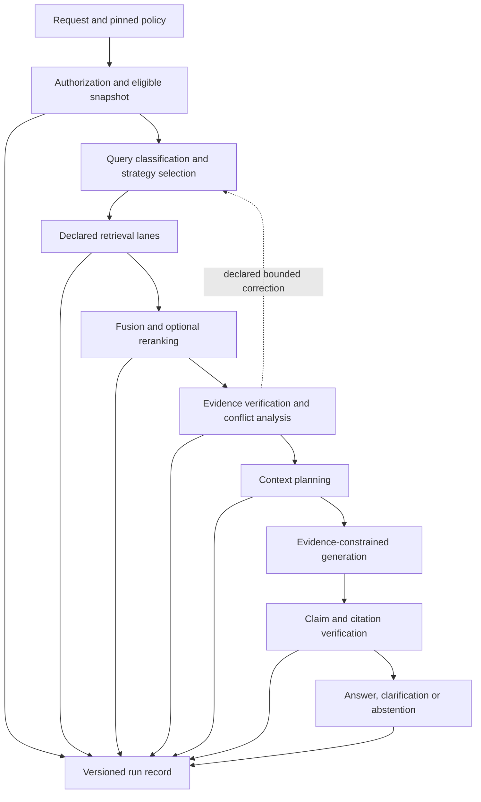

# V2 target architecture

Status: specified, not implemented. Current behavior is recorded in [the assessment](current-system-assessment.md). The target is an Advanced RAG Engineering and Experimentation Platform built by evolving the existing workbench.

## Invariants and execution boundary

`PipelineGraph` remains the platform-owned orchestration IR. Components perform one capability through registry bindings; providers implement interfaces; tools and agents are declared graph participants. Every data, control, conditional, error and feedback dependency is explicit. Components cannot invoke other components secretly. Authorization is a mandatory platform boundary before retrieval, including every corrective iteration and cache lookup.

No classifier, confidence score, generated summary, graph edge, hypothetical document, provider or agent may grant evidence access. Derived representations retain original source identity; system experience is never authoritative evidence.

## Eight layers

| Layer | Responsibility | Required output / boundary |
| --- | --- | --- |
| Evidence platform | Ingestion, immutable originals, provenance, revision, approval, ACL, quality and structural representation | Published evidence snapshot plus policy-controlled source resolver |
| Retrieval laboratory | Exact, persistent BM25, semantic dense, structural, parent-child, typed, visual and graph retrieval | Ranked candidates referencing eligible original evidence |
| Retrieval intelligence | Classification, rewrite, expansion, multi-query, decomposition, adaptive/corrective actions | Versioned decisions retaining original query and bounded action history |
| Ranking/context | RRF, reranking, MMR, contextual chunks, expansion, diversity, compression and budgets | Included/omitted/truncated evidence with reasons and preserved qualifiers |
| Verification | Sufficiency, revision/freshness/applicability, contradictions, claim support, citations and abstention | Explicit support states and delivery decision |
| Experimentation | Datasets/splits, baselines, stage metrics, comparisons, promotion, rejection, rollback | Immutable experiment record with case-level evidence |
| Adaptive retrieval | Permissioned planner, bounded iteration, strategy selection, trajectory/experience use | Declared actions and inspectable stop decisions |
| Learning | Offline policy analysis, reranker/retriever tuning, justified preferences/bandits/RL | Evaluated versioned candidate; never automatic production promotion |

## Contract requirements

All new public records carry a schema version and immutable identity. Public interfaces are typed and provider-neutral. Independently version pipeline, strategy, component, prompt, model, embedding, index, chunker, parser, corpus, dataset, evidence policy and retrieval policy.

| Contract | Required fields and validation |
| --- | --- |
| Evidence package | Evidence/document/source IDs, source bytes hash, original locator, corpus revision, parser/chunker versions, parent/child and derived-source links, approval, ACL, validity, applicability and authority. Publication requires explicit review policy; extraction is not approval. |
| Authorized snapshot | Tenant/principal, permitted corpus and evidence revisions, policy version, evaluation time, scope fingerprint. Index filters and caches bind to this scope before top-k selection. Empty versus unrestricted corpus scope must be explicit. |
| Embedding identity/provider | Model ID/version/digest, dimensions, normalization, query/document encoding configuration, batch/resource limits, timeout/health, index revision and migration behavior. Reject mismatched models/dimensions; build a new index before switching. |
| Query decision | Original query, query class, confidence, required capabilities, recommended lanes, reason and fallback. Confidence is routing telemetry, not authority. |
| Strategy | `strategy_id`, semantic version, graph reference/fingerprint, supported query/content classes, required components/models/indexes, latency/resource expectations, limitations, evaluation dataset and promotion status. |
| Context plan | Ordered included, omitted and truncated evidence; reason per decision, parent/neighbor expansion, quotas, duplication, tokenizer/version, actual versus estimated tokens and qualifier preservation. |
| Claim verification | Claim text/span, evidence IDs, support (`supported`, `partial`, `unsupported`, `conflicting`), verifier/version, confidence and action (`keep`, `qualify`, `remove`, `abstain`). Confidence never substitutes for support. |
| Dataset case | `case_id`, query/class, corpus revision, expected evidence, hard negatives, expected claims, expected abstention, policy constraints and notes; graded relevance where nDCG is used. |
| Run | Request scope/reference, original query protected by retention policy, classification, strategy, all asset versions, graph fingerprint, ranks/scores, context, claims, citations, outcome, budgets, iterations/actions, timings and failures. |
| Experiment | Hypothesis, baseline/candidate identities, dataset split/version, configuration fingerprint, case results, metrics, failure analysis and accept/reject/iterate decision. |

Query classes: `exact_identifier`, `exact_phrase`, `semantic`, `comparison`, `procedure`, `table`, `visual`, `temporal`, `multi_hop`, `relationship`, `conversational`, `no_rag_required`. Unsupported or ambiguous classes use an explicit safe baseline or clarification. A no-RAG route has a separate product policy; it must not emit fabricated source citations.

Initial strategy catalog: `baseline_hybrid_v1`, `hybrid_reranker_v1`, `hybrid_parent_child_v1`, `hybrid_multiquery_v1`, `decomposition_v1`, `corrective_v1`, `graph_augmented_v1`, `visual_evidence_v1`, `adaptive_agentic_v1`. These names are planned identities, not registered runtime components.

## Graph hardening and bounded autonomy

Add explicit terminal bindings instead of relying on `generate`/`context` node names. Validate configuration schemas, port values, capabilities, edge semantics, compatible models/indexes, budgets and bounded cycles before execution. Retain backwards compatibility through a versioned migration rather than silently reinterpreting v1 graphs.

Corrective loops declare maximum iterations, queries, tokens, latency and tool calls; allowed actions; exit condition; fallback; cancellation; and per-iteration tracing. Exhaustion must produce the configured fail/abstain outcome, never reuse an unverified answer. Provider timeouts derive from remaining run budget. Permission checks and scope apply on each iteration.

The retrieval planner may retrieve lexical/dense/structural/typed/graph/visual evidence, rewrite/expand/decompose, rerank, inspect a parent, ask clarification, stop or abstain. It cannot become a general shell or autonomous task agent.

## Persistence and security

Persist terminal success and failure records append-only, with schema migrations and content fingerprints. A run ID cannot overwrite an existing different record. Policy denials need a safe audit record without revealing unauthorized content. Trace reads, exports and source resolution re-check current authorization; historical scope does not grant present access.

Store sensitive query/source content only in an explicitly controlled local artifact store with retention policy; ordinary logs contain identifiers and safe metadata. Keep model/provider credentials server-side. Record redacted errors, never raw credential-bearing exceptions. Reproduction depends on retained immutable assets; if retention deletes an asset, report the run as no longer replayable rather than pretending its fingerprint suffices.

## Local profiles and topology

Target hardware is Apple Silicon M3 on macOS with Docker Desktop. Installed RAM, supported context/model sizes and measured latency envelopes must be recorded before local-real acceptance.

| Profile | Purpose | Acceptance |
| --- | --- | --- |
| `deterministic` | Existing fixture/CI/contracts/fast regression | No model downloads or cloud dependency; preserved behavior |
| `local-real` | Real embeddings, persistent BM25, Qdrant, structural retrieval, reranker and Ollama/MLX generation | Planned; services/models validated on M3 with pinned identities |
| `advanced-research` | Corrective, graph, visual, agentic and learning experiments | Planned; disabled until prerequisites and bounds pass |

Compose hosts Studio, control API, worker, PostgreSQL, MinIO, Qdrant and optional local telemetry. Native Ollama/MLX can provide Apple acceleration; container/native connectivity requires a measured integration check. Redis is added only if a durable queue requirement justifies it. Cloud adapters are optional and explicit.

## Studio

Extend the existing shell after backend instrumentation. Show classification/strategy, lane candidates, fusion/reranking, evidence verification, context decisions, claims/citations/conflicts, iterations, latency/tokens and asset versions. Experiment comparisons show per-case failures and promotion evidence. Disabled/unimplemented controls must say so. Preserve keyboard access, responsive behavior, privacy, cancellation and reviewable AI changes.
